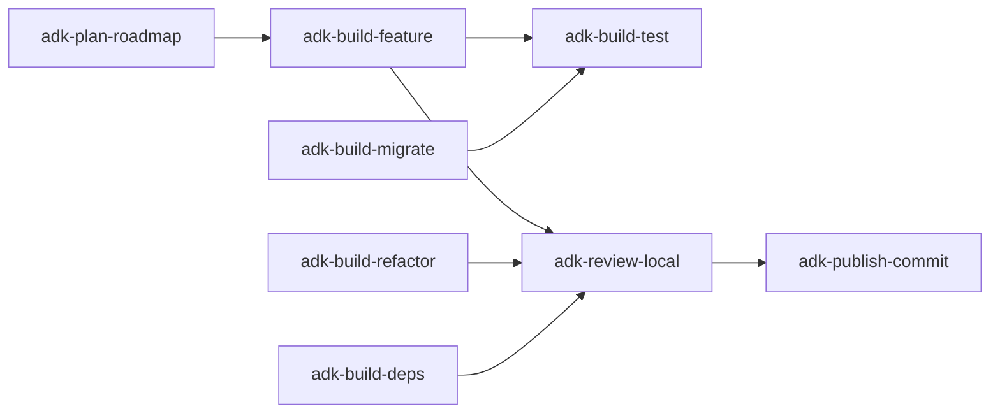

# ADK Build (Category Router)

Routes any "change the code" intent to the right implementation task. Activate one of the listed task skills below; do not implement directly from this router.

## When to use this category

- A feature must be added or extended.
- A bug must be diagnosed and fixed.
- Code structure must change without changing behavior (refactor).
- A framework, library, or runtime must be upgraded or replaced (migrate).
- Tests must be authored or expanded.
- Dependencies must be inventoried, upgraded, or pruned.

## When NOT to use this category

- Direction or design is still open -> `adk-plan`
- Reviewing changes that already exist -> `adk-review`
- Writing docs or specs -> `adk-docs` / `adk-plan-spec`
- Frontend / UI-specific implementation -> `adk-frontend`
- Commit messages or PR text -> `adk-publish-commit`

## Shared workflow

Every task in this category honors the same six steps. The task skills tailor the content of each step.

1. **Confirm intent** - clarify task, scope, validation target, and constraints. Approval gate unless `--auto`.
2. **Scope** - read only the relevant code; gather error context and recent git history if debugging.
3. **Plan** - short, ordered, file-aware plan. Approval gate unless `--auto` or change is trivial single-file.
4. **Execute** - apply the smallest correct change; stay inside scope; flag necessary out-of-scope work.
5. **Validate** - run repo-native tests / lint / type-check; never claim success without fresh evidence.
6. **Report** - changed files with one-line diffs; validation evidence; remaining risk; offer depth on request.

## Task selection

| Task skill | Use when | Do NOT use when |
| --- | --- | --- |
| `adk-build-feature` | New feature, bug fix, behavior enhancement, or systematic debugging | Behavior is unchanged but structure changes -> refactor |
| `adk-build-refactor` | Restructure code, rename, extract, dedupe with no behavior change | Behavior changes - use feature |
| `adk-build-migrate` | Replace a framework, runtime, library version, or build tool | Single-package upgrade with no API change - use deps |
| `adk-build-test` | Author tests, raise coverage, or convert manual checks into automated tests | Implementation is also changing - use feature with test alongside |
| `adk-build-deps` | Inventory, upgrade, deduplicate, audit, or remove dependencies | A framework migration - use migrate |

## Common chains

## Subagent dispatch

Build tasks dispatch focused subagents when work is large enough to benefit from parallelism. Each task skill defines its own dispatch matrix. Do not dispatch for trivial single-file edits.

## Validation discipline

- Run the smallest relevant repo-native check first (target test, lint on changed files, typecheck on touched module).
- Never say "tests pass" or "bug fixed" without command output backing it.
- If validation cannot run, say so explicitly with the reason.

## Activation

Once you have picked a task, load `adk-build-<task>` and follow it. Each task skill is fully standalone - everything it needs is in its own folder.

## Anti-patterns

- Implementing inside this router. Always hand off to a task skill.
- Mixing refactor with feature work in one change. Pick one task per pass.
- Writing >100 lines without a validation run.
- Claiming "fix" without reproducing the original failure first.

<!-- adk:references:start -->

## References shipped with this skill

These files live in `references/` next to this `SKILL.md`. Read them when the skill activates; they are inlined here so the skill is fully self-contained (no cross-skill or shared sources).

| File | Purpose |
| --- | --- |
| `references/anti-patterns.md` | Things to avoid when running this skill. |
| `references/constitution.md` | Non-negotiable rules and working/communication discipline. |

<!-- adk:references:end -->
