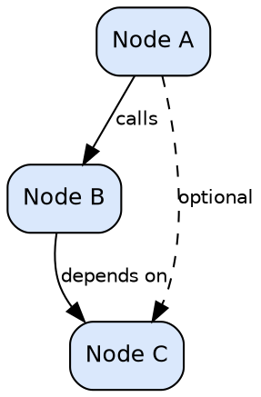
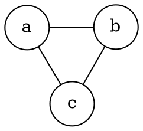
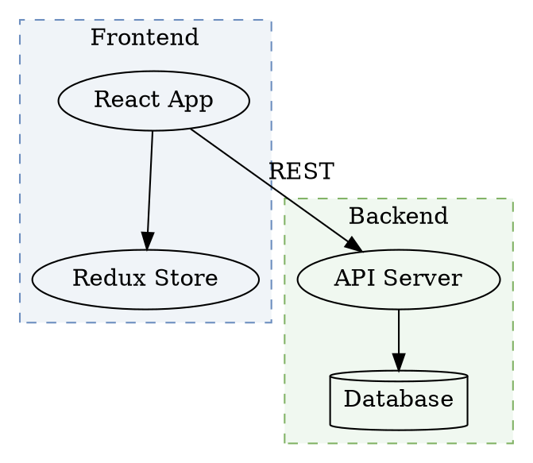
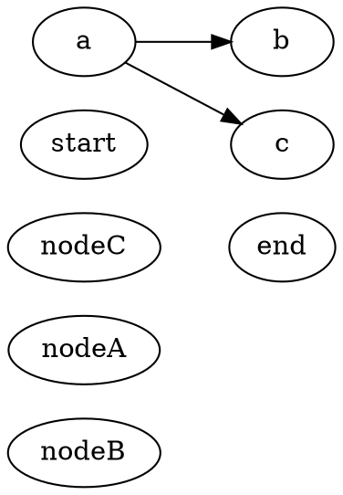
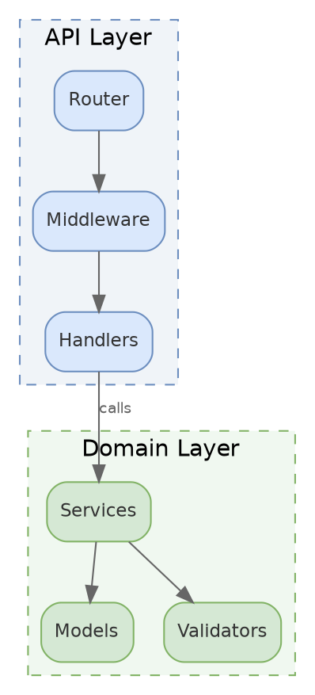

# Graphviz Reference

Use Graphviz when the important part is graph structure, not hand-tuned positioning.

Accepted source extensions:

- `.dot`
- `.gv`
- `.graphviz`

Use `diagramkit-integration.md` for rendering commands. This guide focuses on building the DOT source file.

## Best Fit

Choose Graphviz when:

- the repository already uses `.dot` or `.gv` files
- the diagram is mostly nodes and edges
- layout constraints such as rank, clustering, or ports matter
- the graph should be laid out algorithmically instead of manually

Prefer Mermaid, Excalidraw, or Draw.io for new docs when strict graph layout is not the main requirement.

## Build Rules

1. Use `digraph` for directed relationships and `graph` for undirected ones.
2. Set graph-wide `graph`, `node`, and `edge` defaults near the top of the file.
3. Use semantic node IDs such as `api_gateway` or `user_service`.
4. Use `subgraph cluster_*` for grouped boxes.
5. Use `bgcolor="transparent"` unless the project explicitly needs a fixed background.
6. Prefer descriptive labels over abbreviations.
7. Keep layout hints minimal at first. Add rank constraints or invisible edges only when the default layout is not good enough.

## Minimal Skeletons

### Directed Graph



### Undirected Graph



## Clusters And Subgraphs

Use cluster subgraphs to show domains, layers, or bounded contexts:



Subgraph names must start with `cluster_` to render as grouped boxes.

## Layout Engines

| Engine | Best for | Notes |
| --- | --- | --- |
| `dot` | Hierarchical graphs, DAGs, call trees | Default choice for most software dependency graphs |
| `neato` | Undirected graphs, network-style maps | Spring-model layout |
| `fdp` | Larger undirected graphs | Force-directed placement |
| `sfdp` | Very large undirected graphs | Scalable force-directed layout |
| `circo` | Ring or circular layouts | Good for peer networks |
| `twopi` | Radial or hub-and-spoke layouts | Good for centered graphs |

### Common Layout Controls



Use extra layout constraints only when the default layout is unclear.

## Node Shapes

| Shape | Keyword | Common use |
| --- | --- | --- |
| Box | `box` | Services, modules, components |
| Rounded box | `box` plus `style="rounded"` | Softer service presentation |
| Circle | `circle` | States, simple nodes |
| Ellipse | `ellipse` | General-purpose default |
| Diamond | `diamond` | Decisions |
| Record | `record` | Structured fields or interfaces |
| Cylinder | `cylinder` | Databases and storage |
| Double circle | `doublecircle` | Accept or terminal states |
| Folder | `folder` | File system and package groupings |
| Component | `component` | UML-style components |
| Note | `note` | Annotations |

### Record Nodes

```dot
node [shape=record];
struct [label="{ClassName|+ field1: int\l+ field2: string\l|+ method1(): void\l+ method2(): bool\l}"];
```

Use `\l` for left-aligned lines, `\r` for right-aligned lines, and `\n` for centered text.

### Ports

```dot
node [shape=record];
a [label="<left> Left | <center> Center | <right> Right"];
b [label="<in> Input | <out> Output"];

a:center -> b:in;
```

Use ports when edge attachment points matter.

## Edge Styles

| Style | Attribute | Example |
| --- | --- | --- |
| Solid | default | `a -> b;` |
| Dashed | `style=dashed` | `a -> b [style=dashed];` |
| Dotted | `style=dotted` | `a -> b [style=dotted];` |
| Bold | `style=bold` | `a -> b [style=bold];` |
| Invisible | `style=invis` | `a -> b [style=invis];` |

### Arrowheads

| Arrowhead | Meaning |
| --- | --- |
| `normal` | Standard directional edge |
| `none` | No arrowhead |
| `diamond` | Composition |
| `odiamond` | Aggregation |
| `dot` | Circle endpoint |
| `odot` | Open circle endpoint |
| `box` | Box endpoint |
| `crow` | Many in ER-style notation |
| `tee` | One in ER-style notation |
| `vee` | Open arrow |
| `empty` | Open triangle |

### Labels

```dot
a -> b [label="sync call", fontsize=10, fontcolor="#666666"];
a -> b [headlabel="1", taillabel="*"];
a -> b [xlabel="external label"];
```

Use `xlabel` when normal edge labels overlap the main path.

## Color Guidance

Use mid-tone fills that can survive light and dark renders:

| Purpose | Fill | Font | Stroke |
| --- | --- | --- | --- |
| Primary | `#dae8fc` | `#333333` | `#6c8ebf` |
| Success | `#d5e8d4` | `#333333` | `#82b366` |
| Warning | `#ffe6cc` | `#333333` | `#d6b656` |
| Error | `#f8cecc` | `#333333` | `#b85450` |
| Service | `#e1d5e7` | `#333333` | `#9673a6` |
| Highlight | `#fff2cc` | `#333333` | `#d6b656` |
| Neutral | `#f5f5f5` | `#333333` | `#666666` |

Dark mode renderers generally adapt black text and stroke automatically, but these practices help:

- use `fontcolor="#333333"`
- use `bgcolor="transparent"` instead of white
- avoid very light or very dark fills
- keep default graph colors simple and let post-processing adapt them

## Example: Module Dependency Graph



## Quality Rules

- Use semantic IDs and descriptive labels.
- Group related nodes with `cluster_*` subgraphs.
- Set graph-wide defaults to reduce repetition.
- Keep diagrams focused; split large graphs into multiple files when they stop being readable.
- Use rank constraints or invisible edges sparingly and only when they improve clarity.
