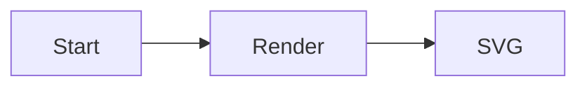

# Diagramkit Setup Reference (fallback)

> Inline fallback for `diagramkit` setup guidance. When the package is installed, prefer:
> - `node_modules/diagramkit/REFERENCE.md` — full CLI + API reference (version-pinned).
> - `node_modules/diagramkit/skills/diagramkit-setup/SKILL.md` — official setup skill.
> - `node_modules/diagramkit/llms.txt` — compact CLI reference.
> - `node_modules/diagramkit/schemas/diagramkit-config.v1.json` — config schema for IDE auto-complete.

## What `diagramkit` gives you

A single CLI / API for authoring **and** rendering diagrams across four engines:

- **Mermaid** — flowchart, sequence, class, state, ER, gantt, gitgraph, mindmap, timeline, C4, pie, quadrant, sankey, XY, block, architecture, kanban, journey, packet, radar, requirement.
- **Excalidraw** — hand-drawn freeform diagrams.
- **Draw.io** — cloud vendor icons (AWS / Azure / GCP), BPMN, swimlanes, multi-page, precise positioning.
- **Graphviz** — DOT algorithmic layouts (dependency graphs, call graphs, rank-constrained DAGs).

Renders to **SVG** (vector) and optionally **PNG / JPEG / WebP / AVIF** (raster, requires `sharp`).

Chromium (Playwright) is used for Mermaid / Excalidraw / Draw.io. Graphviz uses WASM and needs no browser.

## Detect existing state

Before changing anything, check:

1. Is `diagramkit` already in `package.json` `dependencies` / `devDependencies`?
2. Is there a `diagramkit.config.json5` or `diagramkit.config.ts` at the repo root?
3. Are there any diagram source files already (`*.mermaid`, `*.mmd`, `*.excalidraw`, `*.drawio*`, `*.dot`, `*.gv`, `*.graphviz`)?
4. Are `diagramkit-*` skill pointers already installed under `.agents/skills/`, `.claude/skills/`, `.cursor/skills/`, `.codex/skills/`, `.continue/skills/`?

Skip any step whose outcome already exists.

## Steps

### 1. Install

```bash
npm add diagramkit
```

Only add `sharp` if the user will render PNG / JPEG / WebP / AVIF:

```bash
npm add sharp
```

### 2. Warmup

Install the Playwright Chromium binary (needed for Mermaid, Excalidraw, Draw.io; skip if Graphviz-only):

```bash
npx diagramkit warmup
```

### 3. Package scripts

Add to `package.json` `scripts` (only those not present):

```json
{
  "scripts": {
    "render:diagrams": "diagramkit render .",
    "render:diagrams:watch": "diagramkit render . --watch",
    "render:diagrams:check": "diagramkit validate . --recursive"
  }
}
```

Use the repo's existing convention if it has one (e.g. `diagrams:build`).

### 4. Project config

**Always create `diagramkit.config.json5` when the repo has (or will have) any `.mermaid` / `.mmd` source.** The `mermaidLayout: { mode: 'auto' }` setting is what lets the renderer auto-flip `LR ↔ TB` and try ELK when a diagram's aspect ratio drifts wide or tall — without it, every `ASPECT_RATIO_EXTREME` warning has to be fixed source-by-source.

Bootstrap:

```bash
npx diagramkit init --yes
```

Or for programmatic config (function overrides):

```bash
npx diagramkit init --ts
```

If the file already exists, ensure it includes at least:

```json5
{
  $schema: "./node_modules/diagramkit/schemas/diagramkit-config.v1.json",
  mermaidLayout: {
    mode: "auto",
    targetAspectRatio: 4 / 3,
    tolerance: 2.5,
  },
}
```

Layer additional non-default settings only when needed:

| Key              | Default       | Effect                                       |
| ---------------- | ------------- | -------------------------------------------- |
| `outputDir`      | `.diagramkit` | Folder name for rendered outputs             |
| `defaultFormats` | `["svg"]`     | Output formats when none specified           |
| `defaultTheme`   | `"both"`      | `"light"`, `"dark"`, or `"both"`             |
| `sameFolder`     | `false`       | Write outputs next to sources (no subfolder) |
| `outputPrefix`   | `""`          | Prefix added to output filenames             |
| `outputSuffix`   | `""`          | Suffix added before extension                |

If the project is Graphviz-only (no `.mermaid` sources), the `mermaidLayout` block is harmless but unnecessary; the rest of the config is still recommended for explicit format/theme selection.

### 5. Install diagramkit-* skills as project pointers

diagramkit ships every skill inside the npm package at `node_modules/diagramkit/skills/<name>/SKILL.md`. The recommended install is to write **thin pointer SKILL.md files** in the consumer repo that defer to the version-pinned originals.

**Skill set to install** (all live under `node_modules/diagramkit/skills/`):

| Skill                   | Capability                                                                  |
| ----------------------- | --------------------------------------------------------------------------- |
| `diagramkit-setup`      | Bootstrap                                                                   |
| `diagramkit-auto`       | Engine routing for new diagram requests                                     |
| `diagramkit-mermaid`    | Authoring + image generation — Mermaid                                      |
| `diagramkit-excalidraw` | Authoring + image generation — Excalidraw                                   |
| `diagramkit-draw-io`    | Authoring + image generation — Draw.io                                      |
| `diagramkit-graphviz`   | Authoring + image generation — Graphviz                                     |
| `diagramkit-review`     | Validation (SVG structure, ``-embed safety) **+ WCAG 2.2 AA contrast** |

#### Detect target harness folders

Always create the canonical pointer at `.agents/skills/diagramkit-<name>/SKILL.md`. Then mirror it into each harness folder the repo (or the user's tooling) already uses:

| Harness         | Folder              | Detect by                                                |
| --------------- | ------------------- | -------------------------------------------------------- |
| Claude Code     | `.claude/skills/`   | `.claude/` exists, or user mentions Claude / Claude Code |
| Cursor          | `.cursor/skills/`   | `.cursor/` exists, or user mentions Cursor               |
| Codex           | `.codex/skills/`    | `.codex/` exists, or user mentions Codex                 |
| Continue        | `.continue/skills/` | `.continue/` exists, or user mentions Continue           |
| OpenCode / etc. | `.agents/skills/`   | Generic fallback (always written)                        |

#### Pointer template

`.agents/skills/diagramkit-<name>/SKILL.md`:

```markdown
---
name: diagramkit-<name>
description: <copy from node_modules/diagramkit/skills/diagramkit-<name>/SKILL.md>
---

# diagramkit-<name>

Follow the version-pinned skill that ships with the locally installed `diagramkit`:

→ [`node_modules/diagramkit/skills/diagramkit-<name>/SKILL.md`](../../../node_modules/diagramkit/skills/diagramkit-<name>/SKILL.md)

Always anchor on the local install (`npx diagramkit ...`, never a global one). Read `node_modules/diagramkit/REFERENCE.md` first.
```

Mirror file `.claude/skills/diagramkit-<name>/SKILL.md` (or `.cursor/...`, `.codex/...`):

```markdown
---
name: diagramkit-<name>
description: <same as above>
---

# diagramkit-<name>

Follow [`.agents/skills/diagramkit-<name>/SKILL.md`](../../../.agents/skills/diagramkit-<name>/SKILL.md). Do not duplicate its content here.
```

Pointers are tiny and stable across `diagramkit` upgrades — commit them.

### 6. First render

If diagram sources exist:

```bash
npx diagramkit render .
```

Otherwise create a hello-world fixture at `diagrams/hello.mermaid`:



Then:

```bash
npx diagramkit render diagrams/hello.mermaid
ls diagrams/.diagramkit
```

### 7. Embed example (theme-aware)

```html
<picture>
  <source media="(prefers-color-scheme: dark)" srcset=".diagramkit/hello-dark.svg" />
  <source media="(prefers-color-scheme: light)" srcset=".diagramkit/hello-light.svg" />
  
</picture>
```

For Pagesmith pages, the simpler consecutive `-light` / `-dark` markdown image pattern is preferred — Pagesmith auto-merges into a themed `<picture>`.

### 8. CI hook (optional)

```yaml
- name: Render diagrams
  run: |
    npx diagramkit warmup
    npx diagramkit render . --force
    git diff --exit-code -- '*.svg' '*/.diagramkit/**'
```

## Validation

**The setup is not complete** until:

```bash
npx diagramkit render . --force
npx diagramkit validate . --recursive
```

both exit 0 with **zero errors AND zero `LOW_CONTRAST_TEXT` AND zero `ASPECT_RATIO_EXTREME` warnings**. If any remain, loop through the engine SKILL.md fix tactics until clean.

## Rules

- **Always prefer the locally installed CLI** (`npx diagramkit`, never global).
- Never overwrite an existing config file or skill pointer without explicit confirmation.
- Do not install `sharp` unless raster output is required.
- Do not run `warmup` if the project is Graphviz-only.
- Commit diagram source files alongside rendered outputs. Never hand-edit SVGs in `.diagramkit/`.
- Pick **one** install mechanism per repo (local pointers OR `npx skills add sujeet-pro/diagramkit`); never mix.
