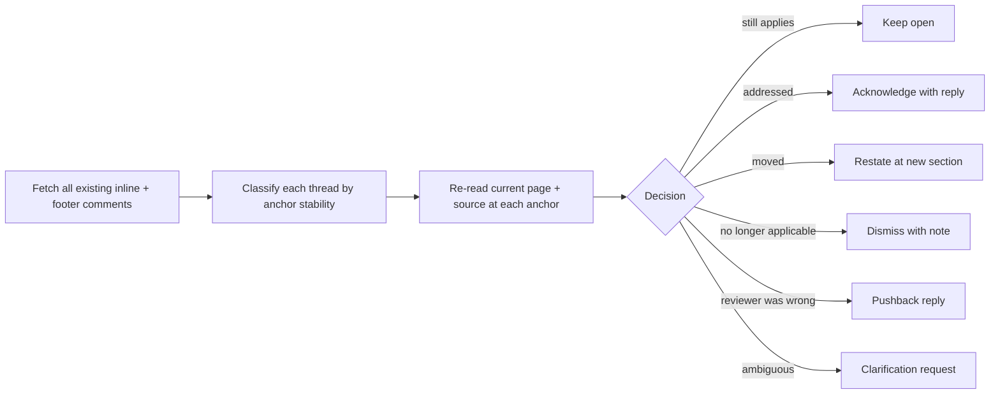

# Doc Comment Reconciliation

How to validate existing comments / replies on a Confluence page against the CURRENT page state before drafting any new comment. Only relevant under `--mode confluence`. Re-reviewing without reconciliation produces duplicates, contradicts past decisions, and breaks reviewer-author trust.

In `--mode local`, this file does not apply — there is no comment thread on a Markdown file in the host repo.

## Why reconciliation runs first

Every Confluence-mode review run does a full-scope fresh review. Existing comments are CONTEXT, not a substitute for that fresh review. Reconciliation closes the loop:

- prevents reposting the same finding the previous reviewer already raised
- catches cases where a "resolved" thread regressed after a later page edit
- catches cases where the section moved but the concern is still valid
- gives the user (and the page owner) a clear "what changed since last round" picture

## Reconciliation pipeline

Run BEFORE drafting any new comment.



## Per-thread reconciliation

For every existing thread on the page, decide one of:

| State | Trigger | Action | Reply template |
| --- | --- | --- | --- |
| `keep-open` | Concern still reproducible at the same section + still disagrees with source | Do nothing; do NOT re-file as a new comment | (none — leave thread alone) |
| `resolved-confirmed` | Page edit addressed the concern, validated against current source-of-truth | Reply acknowledging | `Fix-acknowledged reply` from `doc-reply-templates.md` |
| `resolved-stale` | Page owner replied "fixed" but the concern still reproduces | Reply with restatement; keep thread open | `Anchor-restatement note` |
| `moved` | Section moved to a new heading; concern still valid at new location | Reply on old thread + post new inline at new section | `Stale-comment dismissal` on old + new inline at new location |
| `no-longer-applicable` | Section removed or fundamentally rewritten; concern moot | Reply + close thread | `Stale-comment dismissal` |
| `pushback` | Original commenter was technically wrong (verified against current source) | Reply with evidence; do NOT close | `Pushback reply` |
| `clarify` | Comment is ambiguous; cannot tell if it applies | Reply asking for clarification; do NOT close | `Clarification request` |
| `out-of-scope` | Valid point but belongs on a different page | Create follow-up, then dismiss with link | `Out-of-scope acknowledgement` |

## Anchor stability

Confluence inline comments anchor to a piece of text. When the page is edited:

- exact text still present → anchor holds → re-validate
- text edited but section heading still present → anchor moved or detached → search by heading
- section heading also gone → check page revision history for what replaced it

Never assume anchor stability. Always re-fetch the page and verify the comment's anchor text still exists.

## Duplicate detection

Before drafting a new finding, compare it against every existing thread:

- same section + same dimension → likely duplicate
- different section but same root cause (e.g., the same outdated env var name in two places) → NOT a duplicate; file separately and reference the related thread

If you would file a finding that is a duplicate of an existing thread, do NOT re-file. Either:

- if the existing thread is correct → leave it alone
- if the existing thread is incomplete → REPLY on the existing thread with the additional information rather than opening a new comment

## Section-moved detection

When a previously-commented section heading no longer exists on the page:

1. Search the page for the comment's quoted text snippet.
2. If found at a new heading AND the concern still applies → restate at new location.
3. If found at a new heading AND the concern was addressed by the move → resolve.
4. If not found → mark `no-longer-applicable` and dismiss with a note.

## Output of the reconciliation pass

Always include a reconciliation summary in the report, before the new findings:

```
## Existing-comment reconciliation
- Threads inspected: <n>
- Kept open (still apply): <n>
- Resolved-confirmed: <n>  (replies posted: <n>)
- Resolved-stale (restated): <n>
- Moved (restated at new section): <n>
- No-longer-applicable (dismissed): <n>
- Pushback (reviewer was wrong): <n>
- Out-of-scope (handed off): <n>  (follow-ups created: <n>)
```

## Failure modes

- Skipping reconciliation entirely → duplicate spam, broken page-owner trust, inflated finding counts.
- Reconciling without reading the current source-of-truth → false "resolved" claims; stale concerns leak through.
- Closing a thread because the page owner replied "fixed" without re-validation → the comment system becomes meaningless.
- Filing a "new" finding that is a duplicate of an existing comment.
