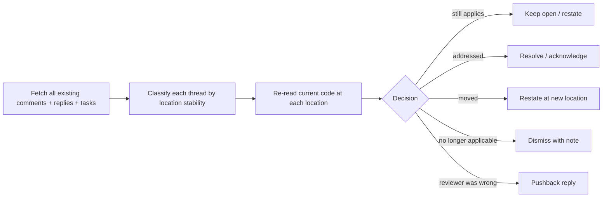

# PR Comment Reconciliation

How to validate existing comments, replies, and (on Bitbucket) tasks against the CURRENT state of the PR before drafting any new comment. Re-reviewing without reconciliation produces duplicates, contradicts past decisions, and breaks the reviewer-author trust loop.

## Why reconciliation runs first

Every PR review run does a full-scope fresh review. Existing comments are CONTEXT, not a substitute for that fresh review. Reconciliation closes the loop:

- prevents reposting the same finding the previous reviewer already raised
- catches cases where a "resolved" thread regressed
- catches cases where the code moved but the concern is still valid
- gives the user (and the author) a clear "what changed since last round" picture

## Reconciliation pipeline

Run this BEFORE drafting any new comment.



## Per-thread reconciliation

For every existing thread on the PR, decide one of:

| State | Trigger | Action | Reply template |
| --- | --- | --- | --- |
| `keep-open` | Concern still reproducible at the same file:line | Do nothing; do NOT re-file as a new comment | (none — leave thread alone) |
| `resolved-confirmed` | Code change addresses the concern, validated against current diff | Reply + (Bitbucket) resolve task | `Fix-acknowledged reply` from `pr-reply-templates.md` |
| `resolved-stale` | Author marked resolved but concern still reproducible | Reply + (Bitbucket) reopen task; restate at current location | `Task-restatement note` |
| `moved` | Code moved to a new location; concern still valid at new location | Reply on old thread + post new inline at new location | `Stale-comment dismissal` on old thread + new finding at new location |
| `no-longer-applicable` | Code removed or fundamentally changed; concern moot | Reply + close thread | `Stale-comment dismissal` |
| `pushback` | Reviewer was technically wrong (verified against current code) | Reply with evidence; do NOT resolve | `Pushback reply` |
| `clarify` | Comment is ambiguous; cannot tell if it applies | Reply asking for clarification; do NOT close | `Clarification request` |

## Bitbucket-specific: tasks

Bitbucket tasks are the must-fix tracking mechanism for Blocker and most Critical findings.

- A task that is OPEN against a thread the code now addresses → resolve task with the `Task-resolution note` AND the `Fix-acknowledged reply`.
- A task that is RESOLVED but the concern still reproduces → reopen the task AND post the `Task-restatement note`.
- A new Blocker or Critical finding being posted → create a new task linked to the inline comment.
- A new Suggestion / Nitpick / Question being posted → no task; the inline comment alone is enough.
- Never resolve a task purely because the author replied "fixed". Always re-validate against the current code.

## Duplicate detection

Before drafting a new finding, compare it against every existing thread:

- same file + overlapping line range AND same dimension → likely duplicate
- different file but same root cause (e.g., the same bug pattern in two callers) → NOT a duplicate; file separately and reference the related thread

If you would file a finding that is a duplicate of an existing thread, do NOT re-file. Either:

- if the existing thread is correct → leave it alone (the original reviewer owns it)
- if the existing thread is incomplete → REPLY on the existing thread with the additional information rather than opening a new comment

## Code-moved detection

When a previously-commented line range no longer exists in the current diff:

1. Search for the comment's quoted snippet in the current PR scope.
2. If found at a new location AND the concern still applies → restate at new location.
3. If found at a new location AND the concern was addressed by the move → resolve.
4. If not found → mark `no-longer-applicable` and dismiss with a note.

## Output of the reconciliation pass

Always include a reconciliation summary in the report, before the new findings:

```
## Existing-comment reconciliation
- Threads inspected: <n>
- Kept open (still apply): <n>
- Resolved-confirmed: <n>  (replies posted: <n>)
- Resolved-stale (reopened): <n>
- Moved (restated at new location): <n>
- No-longer-applicable (dismissed): <n>
- Pushback (reviewer was wrong): <n>
- Bitbucket tasks: <opened> opened / <resolved> resolved / <reopened> reopened
```

## Failure modes

- Skipping reconciliation entirely → duplicate spam, broken author trust, inflated finding counts.
- Reconciling without reading the current code → false "resolved" claims; stale concerns leak through.
- Resolving a Bitbucket task because the author replied "fixed" without re-validation → the task tracker becomes meaningless.
- Filing a "new" finding that is a duplicate of an existing comment → the author cannot tell what is new vs already-handled.
