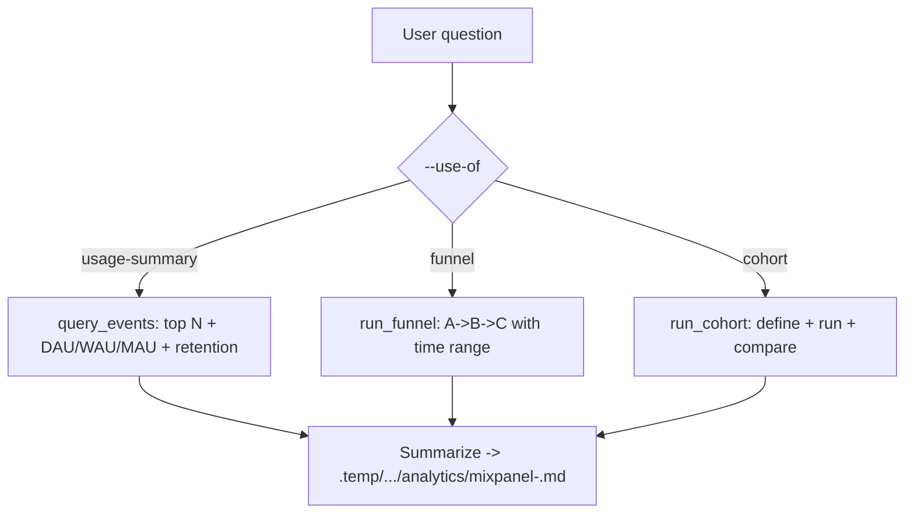
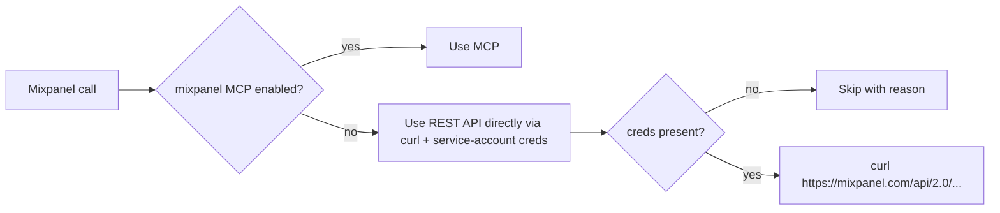

# `analytics-mixpanel` — how it works

```mermaid
flowchart TD
    Q["User question"] --> Use{"--use-of"}
    Use -- "usage-summary" --> US["query_events: top N + DAU/WAU/MAU + retention"]
    Use -- "funnel" --> F["run_funnel: A->B->C with time range"]
    Use -- "cohort" --> C["run_cohort: define + run + compare"]
    US --> Report
    F --> Report
    C --> Report["Summarize -> .temp/.../analytics/mixpanel-<use-of>.md"]
```

## MCP fallback

```mermaid
flowchart LR
    Need["Mixpanel call"] --> M{"mixpanel MCP enabled?"}
    M -- yes --> Use["Use MCP"]
    M -- no --> Fallback["Use REST API directly via curl + service-account creds"]
    Fallback --> Skip{"creds present?"}
    Skip -- no --> Stop["Skip with reason"]
    Skip -- yes --> Curl["curl https://mixpanel.com/api/2.0/..."]
```
