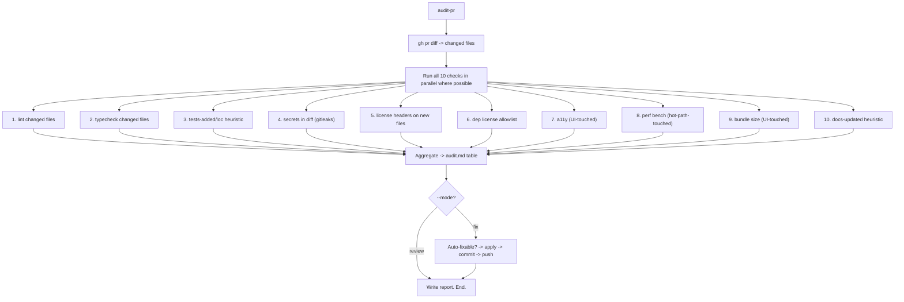

# `audit-pr` — how it works

```mermaid
flowchart TD
    Start["audit-pr <pr-url>"] --> Fetch["gh pr diff <N> -> changed files"]
    Fetch --> Parallel["Run all 10 checks in parallel where possible"]
    Parallel --> C1["1. lint changed files"]
    Parallel --> C2["2. typecheck changed files"]
    Parallel --> C3["3. tests-added/loc heuristic"]
    Parallel --> C4["4. secrets in diff (gitleaks)"]
    Parallel --> C5["5. license headers on new files"]
    Parallel --> C6["6. dep license allowlist"]
    Parallel --> C7["7. a11y (UI-touched)"]
    Parallel --> C8["8. perf bench (hot-path-touched)"]
    Parallel --> C9["9. bundle size (UI-touched)"]
    Parallel --> C10["10. docs-updated heuristic"]
    C1 --> Aggregate
    C2 --> Aggregate
    C3 --> Aggregate
    C4 --> Aggregate
    C5 --> Aggregate
    C6 --> Aggregate
    C7 --> Aggregate
    C8 --> Aggregate
    C9 --> Aggregate
    C10 --> Aggregate["Aggregate -> audit.md table"]
    Aggregate --> Mode{"--mode?"}
    Mode -- "review" --> Done["Write report. End."]
    Mode -- "fix" --> Fix["Auto-fixable? -> apply -> commit -> push"]
    Fix --> Done
```
