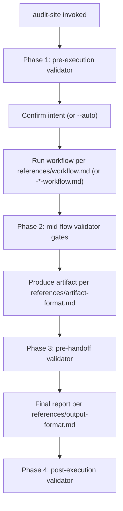

# `audit-site` — how it works

## Decision flow

```mermaid
flowchart TD
    Start["audit-site invoked"] --> Phase1["Phase 1: pre-execution validator"]
    Phase1 --> Confirm["Confirm intent (or --auto)"]
    Confirm --> Workflow["Run workflow per references/workflow.md (or <task>-*-workflow.md)"]
    Workflow --> Phase2["Phase 2: mid-flow validator gates"]
    Phase2 --> Output["Produce artifact per references/artifact-format.md"]
    Output --> Phase3["Phase 3: pre-handoff validator"]
    Phase3 --> Report["Final report per references/output-format.md"]
    Report --> Phase4["Phase 4: post-execution validator"]
```

See `references/workflow.md` (or the task-prefixed workflow file) for the full step list and `references/validator.md` for the four-phase gate.
