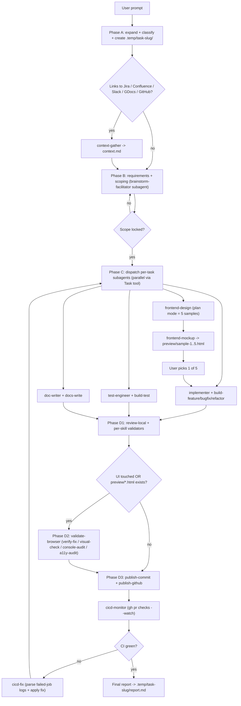
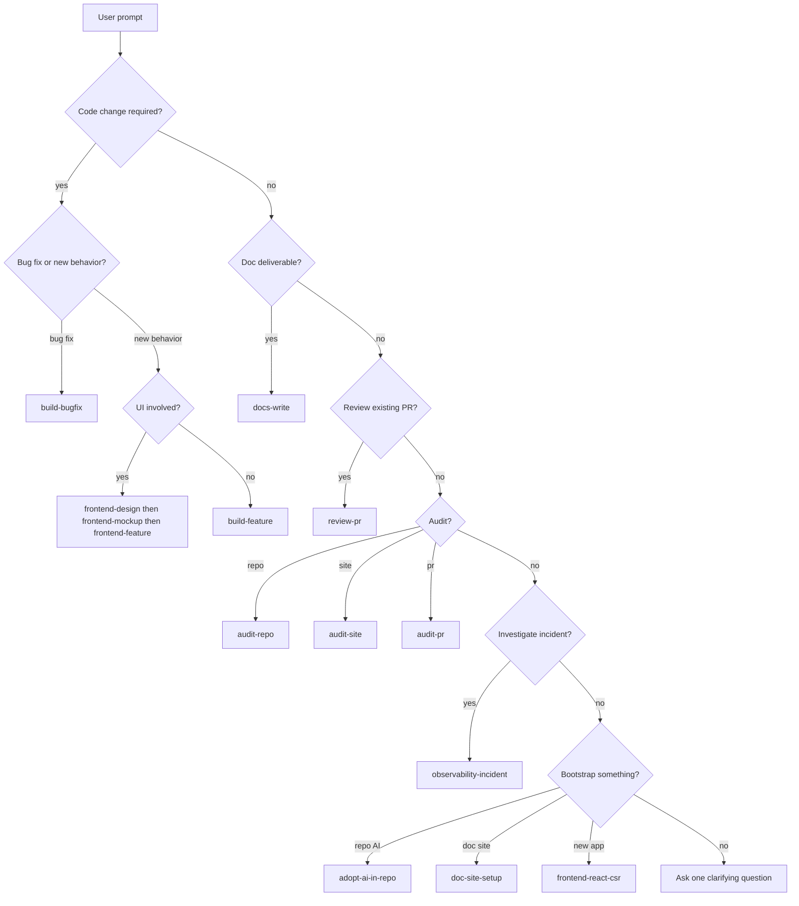
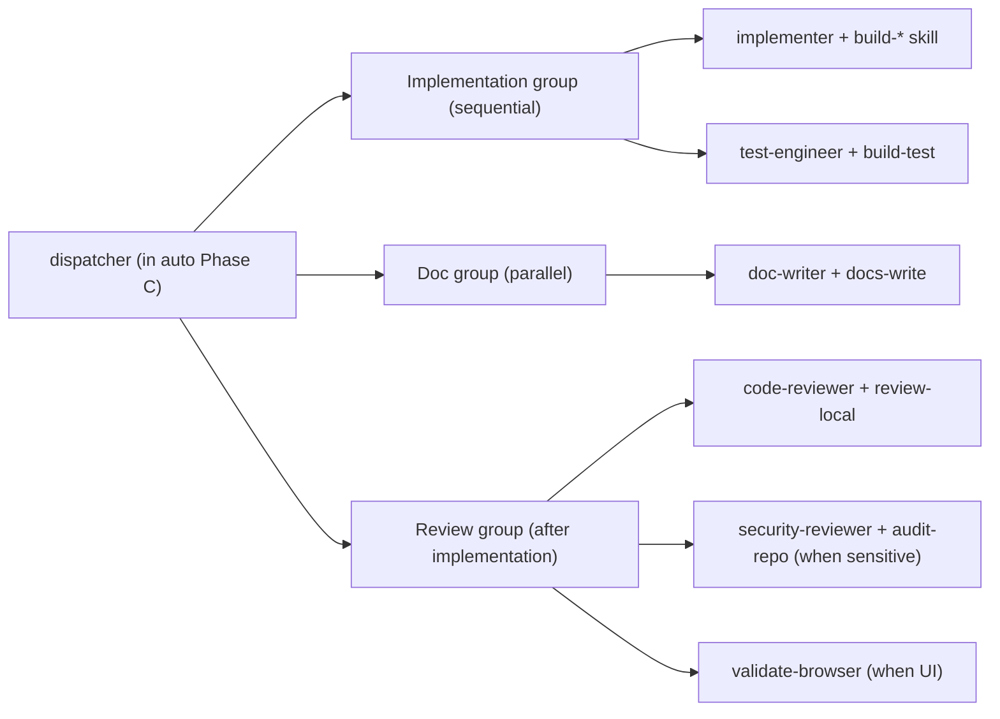

# How `auto` works

## Phase flow

## Domain classification decision tree

## Subagent dispatch matrix

See `references/dispatch-matrix.md` for the full matrix; this diagram shows the most common parallelisable groups.

