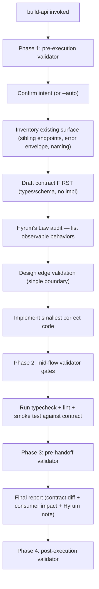

# `build-api` — how it works

## Decision flow

The skill is built around the principle that the **contract is the deliverable** — the implementation is what follows. See `references/error-semantics.md` for the standard status-code / error-code mapping and `references/hyrums-law-audit.md` for the observable-behavior checklist.
