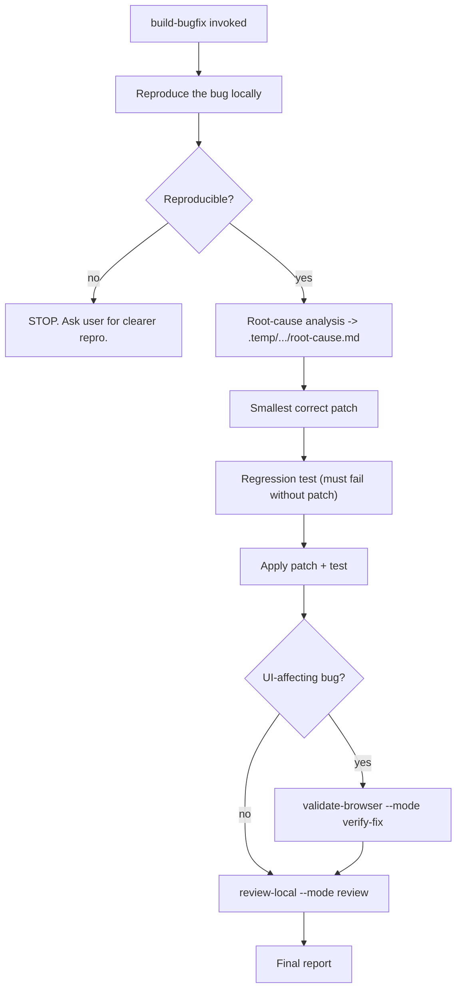
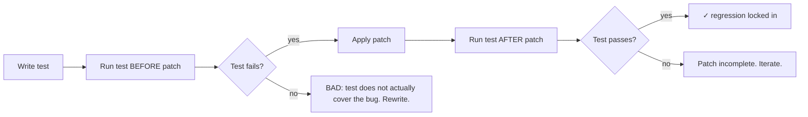

# `build-bugfix` — how it works

```mermaid
flowchart TD
    Start["build-bugfix invoked"] --> Repro["Reproduce the bug locally"]
    Repro --> Conf{"Reproducible?"}
    Conf -- no --> Stop["STOP. Ask user for clearer repro."]
    Conf -- yes --> RCA["Root-cause analysis -> .temp/.../root-cause.md"]
    RCA --> Patch["Smallest correct patch"]
    Patch --> Test["Regression test (must fail without patch)"]
    Test --> Apply["Apply patch + test"]
    Apply --> Verify{"UI-affecting bug?"}
    Verify -- yes --> Browser["validate-browser --mode verify-fix"]
    Verify -- no --> Local
    Browser --> Local["review-local --mode review"]
    Local --> Report["Final report"]
```

## Test-fails-without-patch invariant

```mermaid
flowchart LR
    Test["Write test"] --> Run1["Run test BEFORE patch"]
    Run1 --> Fail{"Test fails?"}
    Fail -- yes --> Apply["Apply patch"]
    Fail -- no --> Bad["BAD: test does not actually cover the bug. Rewrite."]
    Apply --> Run2["Run test AFTER patch"]
    Run2 --> Pass{"Test passes?"}
    Pass -- yes --> Done["✓ regression locked in"]
    Pass -- no --> Wrong["Patch incomplete. Iterate."]
```
