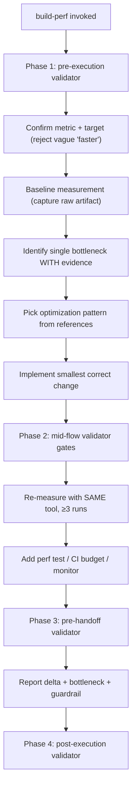

# `build-perf` — how it works

## Decision flow

The skill rejects "make it faster" prompts. See `references/perf-budgets.md` for default budgets, `references/measurement-tools.md` for tool selection per metric, and `references/optimization-patterns.md` for the catalog of patterns indexed by surface.
