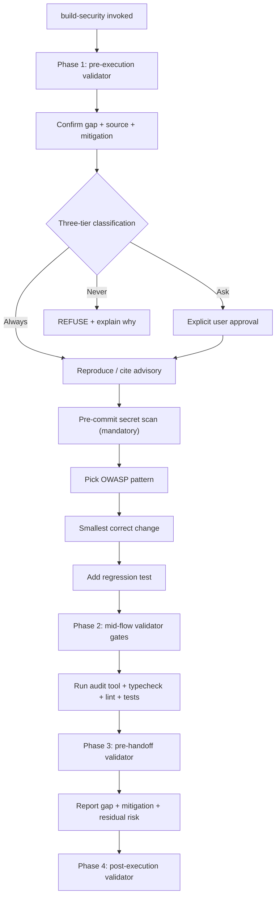

# `build-security` — how it works

## Decision flow

The skill enforces the three-tier boundary system from `references/three-tier-boundaries.md` and consults `references/owasp-patterns.md` for OWASP Top 10 mitigation patterns.
