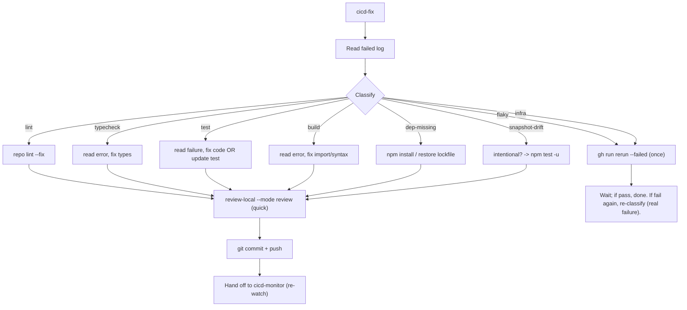
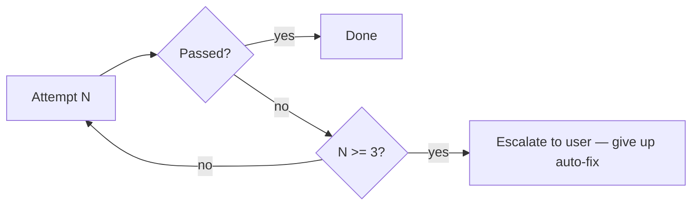

# `cicd-fix` — how it works

```mermaid
flowchart TD
    Start["cicd-fix"] --> Read["Read failed log"]
    Read --> Class{"Classify"}
    Class -- "lint" --> Lint["repo lint --fix"]
    Class -- "typecheck" --> Type["read error, fix types"]
    Class -- "test" --> Test["read failure, fix code OR update test"]
    Class -- "build" --> Build["read error, fix import/syntax"]
    Class -- "dep-missing" --> Dep["npm install / restore lockfile"]
    Class -- "snapshot-drift" --> Snap["intentional? -> npm test -u"]
    Class -- "flaky" --> Rerun["gh run rerun --failed (once)"]
    Class -- "infra" --> Rerun
    Lint --> Local
    Type --> Local
    Test --> Local
    Build --> Local
    Dep --> Local
    Snap --> Local
    Local["review-local --mode review (quick)"] --> Push["git commit + push"]
    Push --> Loop["Hand off to cicd-monitor (re-watch)"]
    Rerun --> Wait["Wait; if pass, done. If fail again, re-classify (real failure)."]
```

## Loop guard

```mermaid
flowchart LR
    Try["Attempt N"] --> Pass{"Passed?"}
    Pass -- yes --> Done
    Pass -- no --> N{"N >= 3?"}
    N -- yes --> Escalate["Escalate to user — give up auto-fix"]
    N -- no --> Try
```
