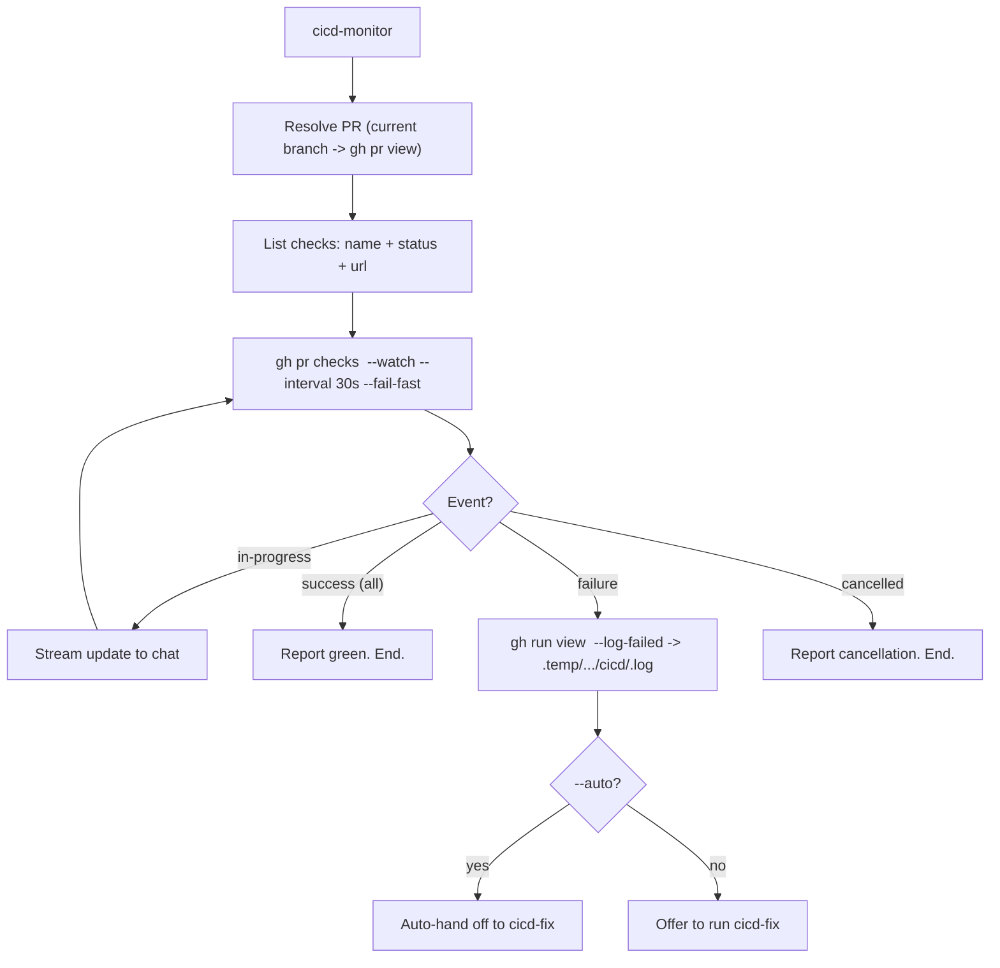
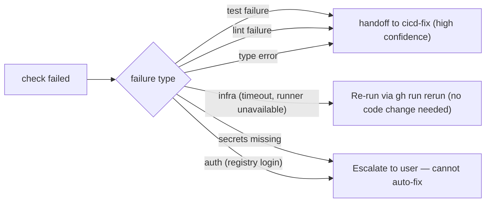

# `cicd-monitor` — how it works

```mermaid
flowchart TD
    Start["cicd-monitor"] --> Resolve["Resolve PR (current branch -> gh pr view)"]
    Resolve --> Initial["List checks: name + status + url"]
    Initial --> Watch["gh pr checks <N> --watch --interval 30s --fail-fast"]
    Watch --> Event{"Event?"}
    Event -- "in-progress" --> Stream["Stream update to chat"]
    Stream --> Watch
    Event -- "success (all)" --> Green["Report green. End."]
    Event -- "failure" --> Capture["gh run view <runId> --log-failed -> .temp/.../cicd/<runId>.log"]
    Capture --> Handoff{"--auto?"}
    Handoff -- yes --> Fix["Auto-hand off to cicd-fix"]
    Handoff -- no --> Offer["Offer to run cicd-fix"]
    Event -- "cancelled" --> Report["Report cancellation. End."]
```

## Decision: when to handoff

```mermaid
flowchart LR
    Fail["check failed"] --> Why{"failure type"}
    Why -- "test failure" --> Hand["handoff to cicd-fix (high confidence)"]
    Why -- "lint failure" --> Hand
    Why -- "type error" --> Hand
    Why -- "infra (timeout, runner unavailable)" --> Retry["Re-run via gh run rerun (no code change needed)"]
    Why -- "secrets missing" --> Escalate["Escalate to user — cannot auto-fix"]
    Why -- "auth (registry login)" --> Escalate
```
