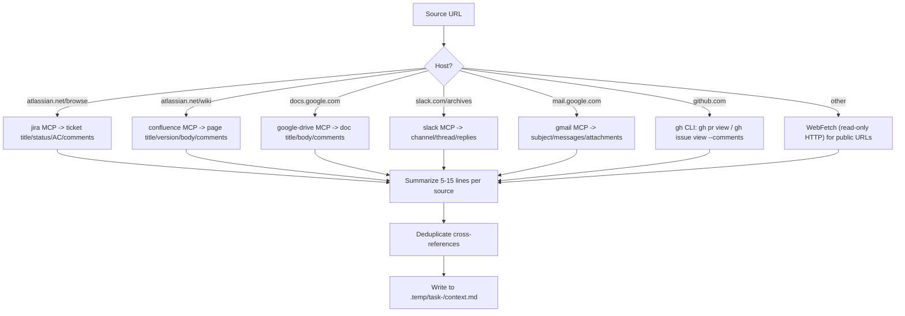
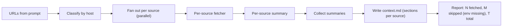
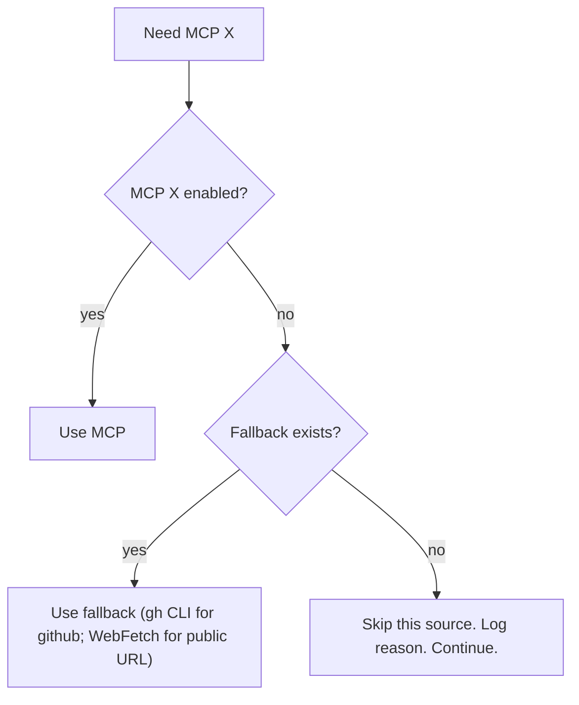

# `context-gather` — how it works

## Per-source decision tree

```mermaid
flowchart TD
    URL["Source URL"] --> Host{"Host?"}
    Host -- "atlassian.net/browse" --> Jira["jira MCP -> ticket title/status/AC/comments"]
    Host -- "atlassian.net/wiki" --> Conf["confluence MCP -> page title/version/body/comments"]
    Host -- "docs.google.com" --> GDoc["google-drive MCP -> doc title/body/comments"]
    Host -- "slack.com/archives" --> Slack["slack MCP -> channel/thread/replies"]
    Host -- "mail.google.com" --> Gmail["gmail MCP -> subject/messages/attachments"]
    Host -- "github.com" --> Gh["gh CLI: gh pr view / gh issue view --comments"]
    Host -- "other" --> WebFetch["WebFetch (read-only HTTP) for public URLs"]

    Jira --> Summarize
    Conf --> Summarize
    GDoc --> Summarize
    Slack --> Summarize
    Gmail --> Summarize
    Gh --> Summarize
    WebFetch --> Summarize

    Summarize["Summarize 5-15 lines per source"] --> Dedupe
    Dedupe["Deduplicate cross-references"] --> Aggregate
    Aggregate["Write to .temp/task-<slug>/context.md"]
```

## Aggregate flow

```mermaid
flowchart LR
    Sources["URLs from prompt"] --> Classify["Classify by host"]
    Classify --> Fanout["Fan out per source (parallel)"]
    Fanout --> Per["Per-source fetcher"]
    Per --> Sum["Per-source summary"]
    Sum --> Collect["Collect summaries"]
    Collect --> Write["Write context.md (sections per source)"]
    Write --> Report["Report: N fetched, M skipped (env missing), T total"]
```

## MCP availability check

```mermaid
flowchart TD
    Need["Need MCP X"] --> Check{"MCP X enabled?"}
    Check -- yes --> Use["Use MCP"]
    Check -- no --> Fallback{"Fallback exists?"}
    Fallback -- yes --> Use2["Use fallback (gh CLI for github; WebFetch for public URL)"]
    Fallback -- no --> Skip["Skip this source. Log reason. Continue."]
```
