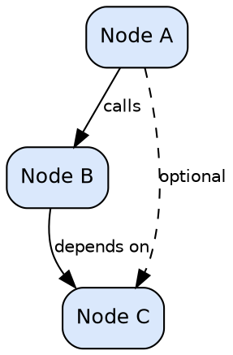
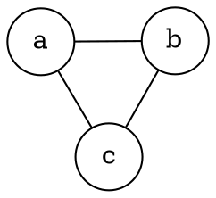
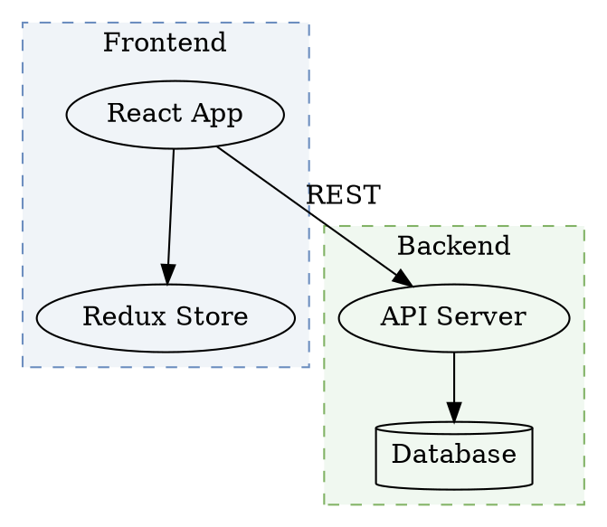
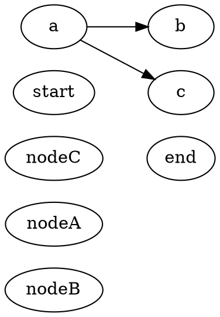
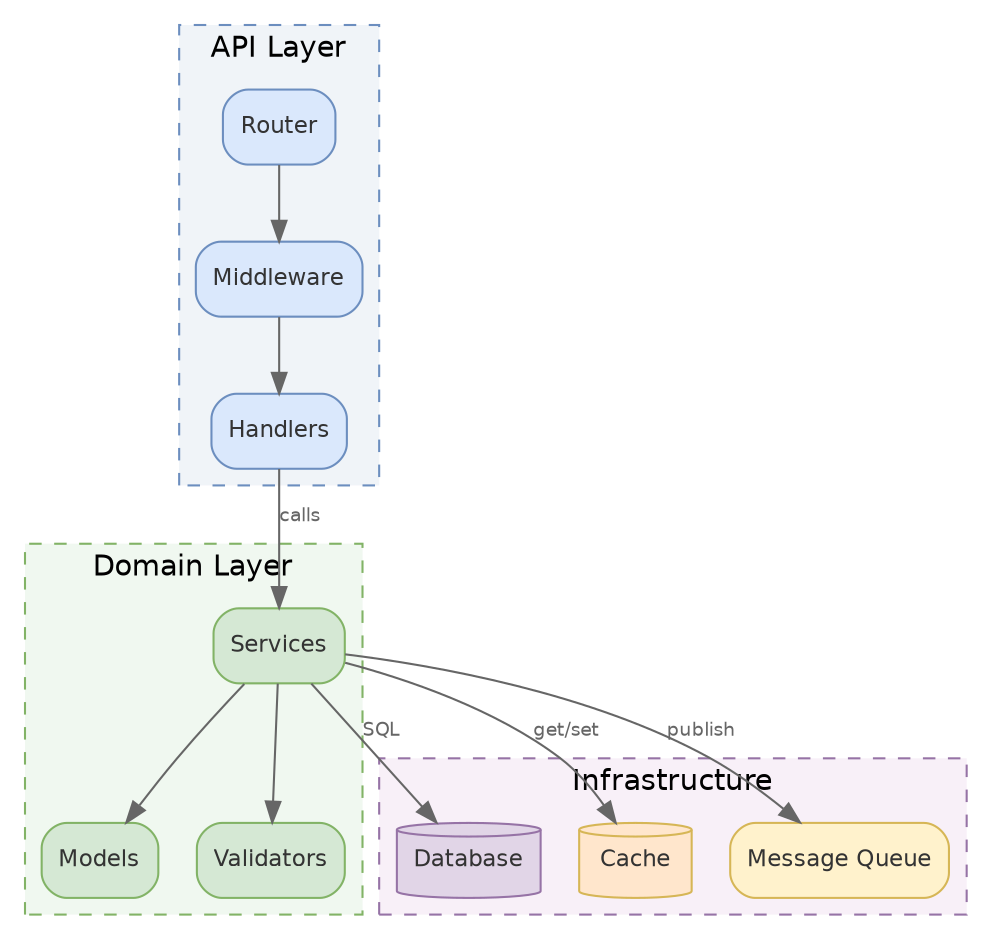
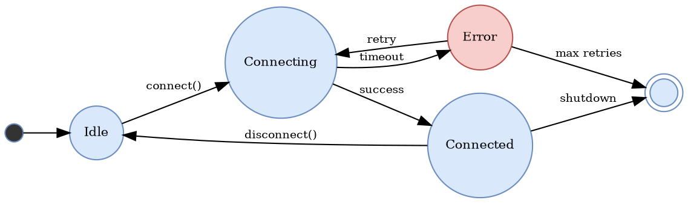

# Graphviz Diagram

Create diagrams using Graphviz DOT language. Strict graph layout control for dependency graphs, call trees, and existing `.dot` assets. WASM-based rendering — no browser or local Graphviz install required.

This skill can be invoked directly or via `/adk:diagram --engine graphviz`.

Prefer Mermaid, Excalidraw, or draw.io for new documentation work. Use Graphviz when:

- The repository already uses Graphviz / `.dot` files
- You need strict algorithmic layout control (not hand-tuned positions)
- The diagram is a pure dependency/call graph where automatic layout excels
- You need advanced Graphviz features (record nodes, ports, rank constraints)

Accepted file extensions: `.dot`, `.gv`

## Shared Skills

This skill uses shared helper skills. Load each skill's reference file ONLY when the condition in "Load When" is met. If a shared skill is not installed, use the inline summary as a fallback.

| Skill | Load When | Inline Fallback |
|-------|-----------|-----------------|
| `/adk:workflow` | always | 6-phase workflow: intent → research → approach → plan → execute → validate. Complexity-adaptive skipping for trivial/small tasks. |
| `/adk:communication` | always | Lead with conclusion. Bullet points. No preamble. Concrete specifics over abstractions. |
| `/adk:preflight-check` | before rendering | Run preflight.py for diagramkit and MCP validation. Ensure npm packages are installed. |
| `/adk:output-format` | when producing output | short/standard/detailed verbosity. Keep both editable source file and rendered SVG. |
| `/adk:principal-engineer` | complexity >= medium | Five questions: need? simplest? alternatives? maintenance costs? clarity in 6 months? |
| `/adk:agentic-teams` | complexity >= medium AND parallel work needed | Launch 2+ child agents with distinct roles. |
| `/adk:interaction` | NOT --auto | Inline protocols for intent confirmation, approach selection, plan approval. |

## Reference Loading

Load reference files conditionally to minimize token usage:

| Reference | Load When |
|-----------|-----------|
| `workflow-6phase.md` | always (read only the section for the current phase) |
| `communication-style.md` | always |
| `preflight.md` | before preflight check |
| `output-formats.md` | when producing final output |
| `output-format-modes.md` | when producing final output |
| `principal-engineer.md` | Phase 0, complexity >= medium |
| `agentic-teams.md` | Phase 4, when launching child agents |
| `inline-interaction.md` | interactive phases, NOT --auto |
| `help-format.md` | when --help is passed |
| `project-guidelines.md` | Phase 1, when scanning project |
| `review-pipeline.md` | review skills only |
| `review-comment-template.md` | when posting review comments |
| `source-routing.md` | when target is external (PR, Confluence, Google Docs) |

## Preflight

`python3 ${CLAUDE_SKILL_DIR}/scripts/preflight.py ${CLAUDE_SKILL_DIR}`

## Parameters

| Parameter | Values | Default | Description |
|-----------|--------|---------|-------------|
| `--render` | flag | off | Render to image after generating source |
| `--format` | `svg`, `png` | `svg` | Output image format |
| `--theme` | `both`, `light`, `dark` | `both` | Theme variants to render |
| `--layout` | `dot`, `neato`, `fdp`, `sfdp`, `circo`, `twopi` | `dot` | Layout engine |
| `--help` | flag | off | Show help |

## Phase Applicability

| Phase | Applies | Notes |
|-------|---------|-------|
| 0. Intent Expansion | yes | Confirm the goal, assumptions, required tools, and success criteria |
| 1. Research & Options | yes | Analyze requirements, determine diagram type and structure |
| 2. Approach Selection | skip | Direct execution after early confirmation |
| 3. Planning | skip | Direct execution |
| 4. Execute | yes | Generate diagram source files |
| 5. Validate & Learn | yes | Verify renderability, naming, consistency |

## Human in the Loop

- **Plan first (Phase 0)**: Always confirm intent — diagram scope, layout engine, and whether updating existing `.dot` files — before generating.
- **Auto mode**: When invoked with `--auto` or by a parent skill, skip confirmations and proceed directly.

## Rendering

```bash
# Default: both light and dark SVG variants
diagramkit render diagram.dot

# PNG only, specific layout engine
diagramkit render diagram.dot --format png --layout neato
```

diagramkit uses WASM-based Graphviz rendering (no browser, no local `dot` binary required). For dark mode, it runs `adaptGraphvizSvgForDarkMode` which:

- Swaps default black strokes and text for dark-surface-compatible colors
- `postProcessDarkSvg` adjusts high-luminance fills using a WCAG luminance threshold of 0.4
- Preserves the graph structure and layout exactly

---

## Workflow

### Phase 0: Intent Confirmation

Confirm: graph type (directed/undirected), nodes, edges, layout engine preference, whether updating existing files.

### Phase 1: Analyze & Plan

If updating existing `.dot` files, read them first and preserve conventions unless cleanup is requested. For new graphs, determine nodes, edges, clusters, and the best layout engine.

### Phase 4: Generate DOT Source

Write a `.dot` file following the reference below.

### Phase 5: Validate & Report

```
Graphviz source file written:
  Source: ./diagrams/dependency-graph.dot

Render with: diagramkit render ./diagrams/dependency-graph.dot
```

---

## DOT Language Reference

### Directed Graph (digraph)



### Undirected Graph



### Subgraphs and Clusters

Subgraph names must start with `cluster_` to be rendered as boxes:



---

## Layout Engines

| Engine | Best For | Algorithm |
|--------|----------|-----------|
| `dot` | Hierarchical/directed graphs, DAGs, call trees | Sugiyama layered layout |
| `neato` | Undirected graphs, network topologies | Spring model (Kamada-Kawai) |
| `fdp` | Large undirected graphs | Force-directed placement |
| `sfdp` | Very large graphs (1000+ nodes) | Scalable force-directed |
| `circo` | Circular layouts, ring topologies | Circular layout |
| `twopi` | Radial layouts, hub-and-spoke | Radial layout |

### Layout Control with `dot`



---

## Node Shapes

| Shape | Keyword | Use For |
|-------|---------|---------|
| Box | `box` | Services, modules, components |
| Rounded box | `box` + `style="rounded"` | Softer visual for services |
| Circle | `circle` | States, decision points |
| Ellipse | `ellipse` | Default; general purpose |
| Diamond | `diamond` | Decision nodes |
| Record | `record` | Structured data (fields) |
| Mrecord | `Mrecord` | Rounded record |
| Cylinder | `cylinder` | Databases, storage |
| Polygon | `polygon` + `sides=N` | Custom shapes |
| Double circle | `doublecircle` | Accept states (automata) |
| Plain | `plaintext` or `none` | Labels without borders |
| Folder | `folder` | File system, packages |
| Component | `component` | UML components |
| Tab | `tab` | Tabbed interfaces |
| House | `house` | Entry points |
| Inverted house | `invhouse` | Sinks |
| Star | `star` | Highlights, special nodes |
| Note | `note` | Annotations |
| Cds | `cds` | DNA/bio diagrams |
| Underline | `underline` | Dictionary entries |

### Record Nodes

```dot
node [shape=record];
struct [label="{ClassName|+ field1: int\l+ field2: string\l|+ method1(): void\l+ method2(): bool\l}"];
```

Use `\l` for left-aligned lines, `\r` for right, `\n` for centered.

### Ports

```dot
node [shape=record];
a [label="<port1> Left | <port2> Center | <port3> Right"];
b [label="<in> Input | <out> Output"];

a:port2 -> b:in;
```

---

## Edge Styles

| Style | Attribute | Example |
|-------|-----------|---------|
| Solid | (default) | `a -> b;` |
| Dashed | `style=dashed` | `a -> b [style=dashed];` |
| Dotted | `style=dotted` | `a -> b [style=dotted];` |
| Bold | `style=bold` | `a -> b [style=bold];` |
| Invisible | `style=invis` | `a -> b [style=invis];` |

### Arrowhead Types

| Type | Description |
|------|-------------|
| `normal` | Standard filled arrow (default) |
| `inv` | Inverted arrow |
| `dot` | Circle |
| `odot` | Open circle |
| `none` | No arrowhead |
| `diamond` | Diamond (composition) |
| `odiamond` | Open diamond (aggregation) |
| `box` | Box endpoint |
| `obox` | Open box endpoint |
| `crow` | Crow's foot (ER many) |
| `tee` | T-bar (ER one) |
| `vee` | V-shaped arrow |
| `curve` | Curved arrow |
| `empty` | Open triangle |

Combine: `arrowhead=odiamond` for aggregation, `arrowhead=diamond` for composition.

### Edge Labels

```dot
a -> b [label="sync call", fontsize=10, fontcolor="#666666"];
a -> b [headlabel="1", taillabel="*"];  // Multiplicity
a -> b [xlabel="external label"];        // Non-overlapping label
```

---

## Color Reference

### Colors for Both Light and Dark Mode

Use mid-tone fills that survive dark mode transformation. Avoid pure white/black.

| Purpose | fillcolor | fontcolor | color (stroke) |
|---------|-----------|-----------|----------------|
| Primary (blue) | `#dae8fc` | `#333333` | `#6c8ebf` |
| Success (green) | `#d5e8d4` | `#333333` | `#82b366` |
| Warning (orange) | `#ffe6cc` | `#333333` | `#d6b656` |
| Error (red) | `#f8cecc` | `#333333` | `#b85450` |
| Service (purple) | `#e1d5e7` | `#333333` | `#9673a6` |
| Highlight (yellow) | `#fff2cc` | `#333333` | `#d6b656` |
| Neutral (gray) | `#f5f5f5` | `#333333` | `#666666` |
| Header (dark blue) | `#4C78A8` | `#ffffff` | `#2E5A88` |

### Dark Mode Behavior

diagramkit uses WASM rendering (no browser) and runs `adaptGraphvizSvgForDarkMode`:

1. Default black strokes (`#000000`) are swapped for light colors visible on dark surfaces
2. Default black text is lightened for readability
3. `postProcessDarkSvg` checks fill luminance against WCAG threshold (0.4):
   - High-luminance fills (light colors like `#dae8fc`) are darkened proportionally
   - Low-luminance fills (already dark) are kept or slightly lightened
4. Transparent/no-fill elements get the dark surface background

**Guidelines for best results:**

- Use `fontcolor="#333333"` — it adapts to both modes
- Use the fill colors from the table above — they are designed for both modes
- Avoid `bgcolor="white"` on graphs — use `bgcolor="transparent"` instead
- Avoid very light fills (> 0.9 luminance) — they lose distinction when darkened
- Avoid very dark fills (< 0.1 luminance) — they become invisible on dark backgrounds

---

## Complete Example: Module Dependency Graph



## Complete Example: State Machine



---

## Quality Standards

1. **Use semantic node IDs** — `api_server` not `a`, `auth_service` not `n1`.
2. **Use descriptive labels** — `PostgreSQL Primary` not `DB`.
3. **Group related nodes** in `cluster_` subgraphs.
4. **Use consistent styling** — same colors for same component types.
5. **Set graph-level defaults** for `node` and `edge` to reduce repetition.
6. **Keep it focused** — max 30-40 nodes per graph; split into multiple files for complex systems.
7. **Use `bgcolor="transparent"`** for graph background — allows dark mode adaptation.
8. **Use `fontcolor="#333333"`** — adapts well to both light and dark modes.

## When to Use Graphviz vs Other Engines

| Use Case | Preferred Engine | Why |
|----------|-----------------|-----|
| Automatic dependency layout | **Graphviz** | Best algorithmic layout |
| Existing `.dot` files | **Graphviz** | Preserve conventions |
| Strict rank constraints | **Graphviz** | `rank=same`, `rank=min/max` |
| Record/port nodes | **Graphviz** | Only engine with ports |
| Architecture overview | **Excalidraw** | Hand-drawn feel, better for presentations |
| Sequence/ER/Gantt | **Mermaid** | Native support for these types |
| Network topology | **draw.io** | Rich infrastructure icon library |
| Precise manual layout | **draw.io** | Exact pixel positioning |

---

## Adjacent Skills

- `/adk:diagram` — parent routing skill that auto-detects engine
- `/adk:diagram-mermaid` — text-based diagrams (flowcharts, sequence, ER, etc.)
- `/adk:diagram-excalidraw` — hand-drawn architecture diagrams
- `/adk:diagram-drawio` — precise layout with rich icon library
- `/adk:docs-write` — documentation that may embed diagrams
