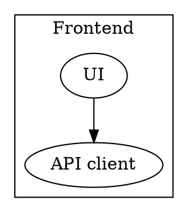
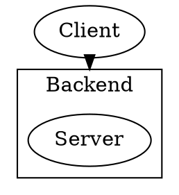

# Subgraphs and clusters

Clusters group nodes visually (boxed regions). Plain **`subgraph`** scopes attributes; **drawn clusters** need the naming rule below.

## Cluster naming

To render as a **boxed cluster**, the subgraph ID must start with **`cluster_`**:



Names without `cluster_` are logical subgraphs (ranking, grouping) but **not** drawn as Graphviz clusters.

## Cluster attributes

Set on the `subgraph` block like graph attributes:

```dot
subgraph cluster_x {
    graph [label="Layer X", style=dashed, color="#6c8ebf",
           fillcolor="#f0f4f8", bgcolor="#f8fafc", fontname="Helvetica"];
    ...
}
```

Common: **`label`**, **`style`**, **`color`** (border), **`fillcolor`**, **`bgcolor`**, **`fontname`**, **`fontsize`**.

## Nested clusters

Nest `subgraph cluster_*` blocks for hierarchy — inner clusters sit inside outer boxes.

```dot
subgraph cluster_system {
    subgraph cluster_svc_a { a1; a2; }
    subgraph cluster_svc_b { b1; }
}
```

## Edges across cluster boundaries

Edges can connect any nodes regardless of cluster. The edge is drawn across the boundary automatically.

For **labels** that reference layers, anchor context with cluster membership via node placement, not separate “cluster nodes.”

## Compound mode (`compound=true`)

To draw an edge **to or from a cluster border** (not just a node inside), set:



- **`lhead`**: logical head is cluster name (cluster subgraph ID).
- **`ltail`**: logical tail attaches to cluster border.

Requires **`compound=true`** on the root graph. Often used with **`newrank=true`** for complex rankings (check layout if ordering looks wrong).

## Tips

- Keep **cluster IDs** stable and descriptive (`cluster_auth`, not `cluster_1`).
- Match **fill/border colors** to your diagram legend for layer types.
- For dark-mode rendering (e.g. diagramkit), prefer **`bgcolor="transparent"`** on the outer graph and mid-tone fills per main skill doc.
