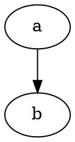
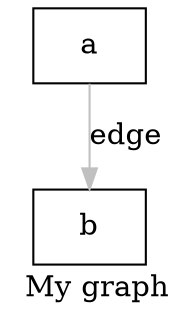
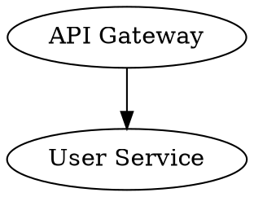

# DOT language — core syntax

Quick reference for Graphviz DOT (`.dot`, `.gv`). **Semicolons are optional** but recommended.

## Graph types

| Form | Meaning |
|------|---------|
| `digraph name { ... }` | **Directed**; edges use `->`. |
| `graph name { ... }` | **Undirected**; edges use `--`. |
| `strict digraph` / `strict graph` | **No multi-edges** between the same node pair. |



## Statements

- **Node**: `id [attrs];` or `id;`
- **Edge**: `a -> b -> c` (chain) or `a -- b` (undirected)
- **Attribute**: `[key=value, ...]` on graph, node, or edge defaults
- **Subgraph**: `subgraph name { ... }` — see `clusters.md`



## Edge operators

- Directed: `a -> b`
- Undirected: `a -- b` (only in `graph { }`, not `digraph`)

## IDs and quoting

**Double-quote** IDs with spaces or special characters. Escapes: `\"`, `\\`, `\n`.



## Comments

- Line: `//`
- Block: `/* ... */`

## Attributes

Syntax: `[ key=value, key=value ]` — attach to a single statement or use **global defaults**:

```dot
digraph {
    graph  [rankdir=LR, bgcolor="transparent"];
    node   [fontname="Helvetica", fontsize=12];
    edge   [fontsize=10];
    a -> b;
}
```

`graph [...]` is graph-level; `node [...]` / `edge [...]` apply to items **after** them in the same block (subgraphs may override).

## Chains

```dot
a -> b -> c;              /* a->b and b->c */
{ rank=same; x; y; z; }  /* rank: see edges.md */
```
