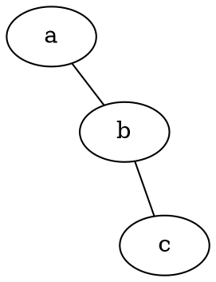
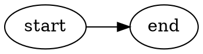

# Layout engines

Pick **`-K` / `--layout`** (`dot`, `neato`, …) to match structure. diagramkit: `diagramkit render file.dot --layout <engine>`. You can also set `layout=<engine>` on a **`graph { }`** statement for undirected files.

## Engine reference

| Engine | Model | Best for |
|--------|--------|----------|
| **`dot`** | Layered (Sugiyama-style) | **DAGs**, call graphs, dependency trees, layered architectures. Default for most `digraph` work. **`rankdir`**: `TB` / `BT` / `LR` / `RL`. |
| **`neato`** | Spring / energy (Kamada–Kawai) | **Undirected** graphs, moderate size. **No** useful `rank=same` semantics. |
| **`fdp`** | Force-directed (Fruchterman–Reingold) | Larger undirected graphs; often **better with clusters** than neato. |
| **`sfdp`** | Scalable force-directed (Barnes–Hut) | **Very large** graphs (often **1000+** nodes). |
| **`circo`** | Circular | **Ring-like** or cyclic structures; nodes on circles. |
| **`twopi`** | Radial | **Hub-and-spoke**; root-centered layers radiating outward. |
| **`osage`** | Cluster-first | **Heavy clustering**: layout **clusters** then inner nodes. |
| **`patchwork`** | Treemap | **Hierarchical** data as **nested rectangles** (size / share). |

## When to use which

| Your graph looks like… | Prefer |
|------------------------|--------|
| Dependencies, pipelines, **needs `rank=same` / `rank=min`** | **`dot`** |
| Network “blob”, no strict layers | **`neato`** or **`fdp`** |
| 1000+ nodes, cluttered spring layout | **`sfdp`** |
| Ring / cycle emphasis | **`circo`** |
| Central root, spokes / shallow trees | **`twopi`** |
| Many **`cluster_`** subgraphs | **`osage`** or **`fdp`** (compare) |
| Partitions, **area** / proportion | **`patchwork`** |

## Practical notes

- **`dot`** is the default mental model for **directed** engineering diagrams here.
- **`rankdir`** and rank subgraphs are **`dot`**-centric; do not rely on them for **`neato` / `fdp` / `sfdp`**.
- **`ortho`** splines and **`compound`** clusters pair best with **`dot`**-style structure first.
- Undirected: if **`neato`** looks wrong, try **`fdp`**; if slow or huge, try **`sfdp`**.
- **`patchwork`** and **`osage`** expect graph/cluster structure to match their layout model (tree-ish or cluster-heavy inputs work best).
