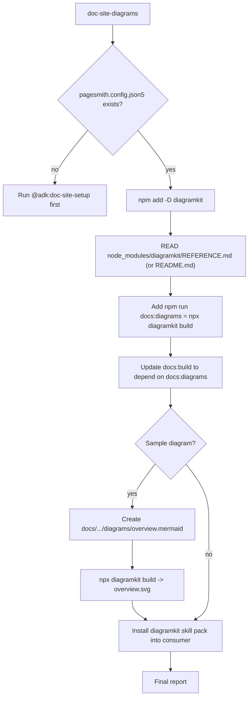
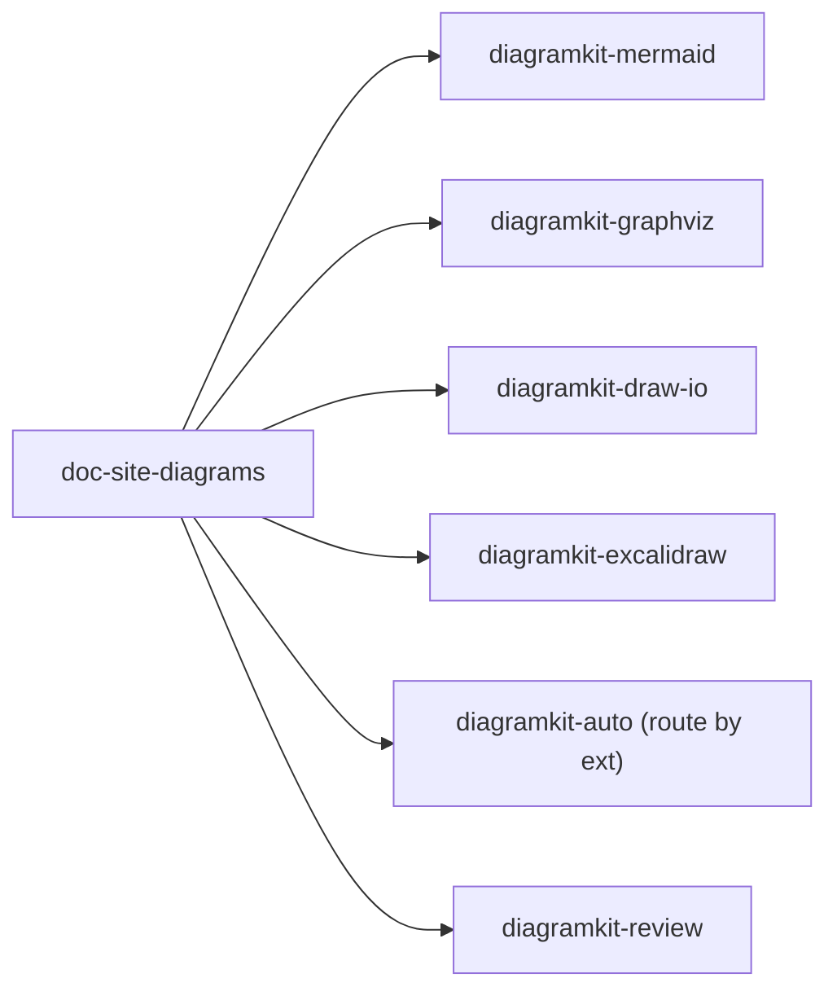

# `doc-site-diagrams` — how it works

```mermaid
flowchart TD
    Start["doc-site-diagrams"] --> Check{"pagesmith.config.json5 exists?"}
    Check -- no --> Run["Run @adk:doc-site-setup first"]
    Check -- yes --> Install["npm add -D diagramkit"]
    Install --> Read["READ node_modules/diagramkit/REFERENCE.md (or README.md)"]
    Read --> Script["Add npm run docs:diagrams = npx diagramkit build"]
    Script --> Wire["Update docs:build to depend on docs:diagrams"]
    Wire --> Demo{"Sample diagram?"}
    Demo -- yes --> Sample["Create docs/.../diagrams/overview.mermaid"]
    Sample --> Render["npx diagramkit build -> overview.svg"]
    Render --> Pkg
    Demo -- no --> Pkg["Install diagramkit skill pack into consumer"]
    Pkg --> Done["Final report"]
```

## Delegation map

```mermaid
flowchart LR
    DS["doc-site-diagrams"] --> Mer["diagramkit-mermaid"]
    DS --> Gv["diagramkit-graphviz"]
    DS --> DI["diagramkit-draw-io"]
    DS --> Ex["diagramkit-excalidraw"]
    DS --> Auto["diagramkit-auto (route by ext)"]
    DS --> Rev["diagramkit-review"]
```
