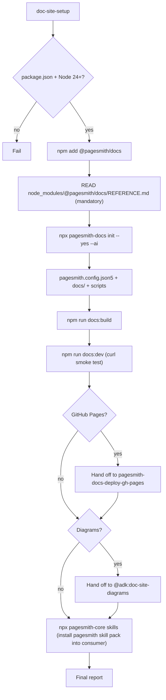
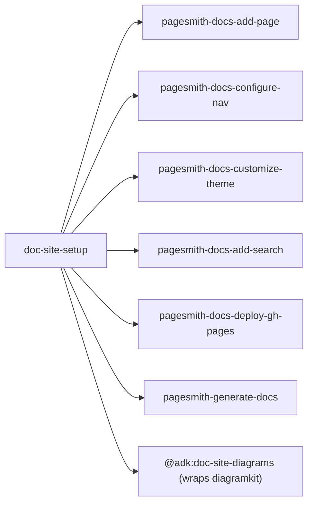

# `doc-site-setup` — how it works

## Delegation map

This skill ONLY bootstraps. All ongoing work (add a page, configure nav, customize theme, add search, deploy, generate from sources, render diagrams) is done by the delegate skills.
