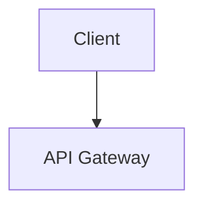

# Document Writing

> **Dependencies**: This skill works best with the full devkit installed (`/plugin install devkit-full@claude-devkit` or `zsh install.zsh`). It uses guidelines from `guidelines/document/` and `guidelines/coding/`, and delegates to agents (`research-agent`, `code-snippet-agent`, `diagram-agent`). If guidelines or agents are missing, the skill still works but with reduced quality enforcement.

Write comprehensive documents with diagrams, code examples, and proper formatting. Output to local markdown, Confluence, or Google Docs.

> **Specialized skills available**: For specific document types, consider using:
> - `/blog` — Blog posts with narrative structure and opinion-driven content (write, review, or update)
> - `/article` — Deep technical articles with exhaustive research (write, review, or update)
> - `/project-docs` — Project documentation from codebase scanning (write, review, or update)
>
> This skill (`/doc-write`) is the general-purpose writer for any document type.

## Guideline Loading

Before writing, load the appropriate guidelines:

1. **Always load**: `guidelines/document/general.md` (baseline document standards)
2. **If `doc-type` specified**: Load the type-specific guideline from `guidelines/document/<doc-type>.md`
3. **If `doc-type` not specified**: Auto-detect from the topic/outline (same detection logic as `/doc-review`)
4. **For code examples**: Load `guidelines/coding/general.md` + `guidelines/coding/expressive-code.md`
5. **Check current repo** (highest priority — overrides devkit guidelines):
   - Document guidelines: `docs/guidelines/document/`, `guidelines/document/`, `.github/guidelines/`, `CLAUDE.md` (`## Document Guidelines` or `## Writing Guidelines`)
   - Coding guidelines: `docs/guidelines/coding/`, `guidelines/coding/`, `coding-guidelines/`, `CLAUDE.md` (`## Coding Guidelines` or `## Code Style`)
   - Markdown conventions: `.markdown-guidelines.md`, `MARKDOWN.md`, `docs/markdown-style.md`

## Workflow

### Phase 1: Research

Spawn a research agent to gather comprehensive, current information on the topic:

1. Use `WebSearch` to find authoritative sources, recent developments, and best practices related to the topic.
2. Use `WebFetch` to pull detailed content from the most relevant sources.
3. Identify:
   - Key concepts and their relationships
   - Architecture or system components that should be diagrammed
   - Common patterns and anti-patterns
   - Code examples from official documentation or well-known projects
4. Compile a research summary with source URLs for citation.

All information must be current and accurate. Do not rely solely on training data — verify with live sources.

### Phase 2: Outline

Create a detailed document outline:

1. Title and abstract/summary (1-2 sentences)
2. Table of contents with all sections and subsections
3. For each section, note:
   - Key points to cover
   - Whether a diagram would add value (and what type)
   - Whether a code example is needed (and what it should demonstrate)
4. Identify prerequisites or background knowledge the reader needs

Present the outline to the user for approval. Wait for confirmation before proceeding. If the user requests changes, revise and re-present.

Adjust outline depth based on the `depth` argument:
- **overview**: High-level, 3-5 sections, minimal code, 1-2 diagrams max
- **standard**: Thorough coverage, 5-10 sections, moderate code examples, 2-4 diagrams
- **deep-dive**: Exhaustive, 10+ sections, extensive code with edge cases, 4+ diagrams, performance considerations, troubleshooting

### Phase 3: Write Content

Write each section following these standards:

#### Writing Style
- Target the specified `audience` (default: senior engineers).
  - **beginner**: Explain all concepts, define jargon, step-by-step instructions.
  - **intermediate**: Assume basic knowledge, focus on practical application.
  - **senior**: Assume strong fundamentals, focus on trade-offs, architecture, and nuance.
  - **staff**: Assume deep expertise, focus on system-wide implications, organizational impact, and strategic decisions.
- Use active voice and direct language.
- Every claim must be technically accurate and verifiable.
- Include "why" explanations, not just "what" and "how."

#### Code Examples

Delegate code block writing to the **code-snippet-agent** which applies expressive-code conventions from `guidelines/coding/expressive-code.md`:

- Always include the language identifier
- Use `title="path/to/file.ext"` for file-specific code
- Use `collapse={ranges}` for imports, boilerplate, and setup
- Use `{line-ranges}` to highlight the lines being discussed
- Use `frame="terminal"` for CLI commands
- Include realistic imports (collapsed) so examples are runnable
- Add inline comments for non-obvious logic only

#### Section Transitions
- End each section with a brief transition to the next topic.
- Use callout blocks for warnings, tips, and important notes.

### Phase 4: Generate Diagrams

Use the `/diagram` orchestrator skill for each diagram identified in the outline. The orchestrator will automatically select the best engine (Mermaid or Excalidraw) based on diagram type.

**Engine selection for documents:**
- **First/header diagram** (overview, architecture): Use Excalidraw via `/diagram --engine=excalidraw` — visual, approachable overview at the top of the document.
- **Detailed diagrams** (sequences, flowcharts, ERDs, state machines, class diagrams): Use Mermaid via `/diagram --engine=mermaid` — structured, precise, renders inline in markdown.

**Output format by target:**
- **Markdown** (`format=markdown`): Render to SVG. Embed inline or as ``.
- **Confluence** (`format=confluence`): Render to SVG, then convert to JPEG via `/image-transform`. Upload JPEG for display, source file as attachment.
- **Google Docs** (`format=google-doc`): Render to SVG, then convert to JPEG via `/image-transform`.

**For each diagram:**

1. Invoke `/diagram` with the appropriate description, type, engine, and format.
2. Save all formats in a `diagrams/` subdirectory:
   - `diagram-name.mermaid` or `diagram-name.excalidraw` (source)
   - `diagram-name.svg` (rendered SVG)
   - `diagram-name.jpg` (JPEG, if target requires it)

3. In the document, embed each diagram with alt text AND a link to the source:

For SVG (markdown target):
```markdown

<details><summary>Diagram source</summary>

Source: [architecture.excalidraw](./diagrams/architecture.excalidraw) or [architecture.mermaid](./diagrams/architecture.mermaid)

</details>
```

For inline Mermaid (when SVG rendering is not available):
````markdown

````

### Phase 5: Format & Output

Output the document based on the `format` argument:

#### Markdown (default)
- Write the complete document to the local filesystem.
- Place diagrams in a `diagrams/` subdirectory relative to the document.
- Ensure all relative links and image paths are correct.

#### Confluence
- Use `mcp__atlassian-confluence__confluence_create_page` or `mcp__atlassian-confluence__confluence_update_page` to create/update the page.
- Convert markdown to Confluence storage format (XHTML):
  - Headings to `<h1>`-`<h6>` tags
  - Code blocks to `<ac:structured-macro ac:name="code">` with language parameter
  - Tables to `<table>` with Confluence classes
  - Blockquotes to `<ac:structured-macro ac:name="quote">`
  - Images to `<ac:image><ri:attachment ri:filename="name.jpg"/></ac:image>`
- Upload all diagram images via `mcp__atlassian-confluence__confluence_upload_attachment`.
- Upload diagram source files as additional attachments.

#### Google Docs
- Use `mcp__google-drive__createGoogleDoc` to create the document.
- Use `mcp__google-drive__insertText` to write content section by section.
- Use `mcp__google-drive__insertImageFromUrl` for diagrams (host images or use a temporary URL).
- Apply text styles via `mcp__google-drive__applyTextStyle` and paragraph styles via `mcp__google-drive__applyParagraphStyle`.

### Phase 6: Iterative Quality Loop

Run an iterative review-fix cycle on the generated document. **Max 3 iterations.**

```
iteration = 0
max_iterations = 3

while iteration < max_iterations:
    iteration += 1
    issues = verify_document()
    if no CRITICAL or WARNING issues: break
    fix(issues)
    if no fixes applied this iteration: break  # stuck — stop
```

**Each iteration, verify:**

1. **Structural integrity:**
   - All image paths resolve correctly
   - All code examples have correct syntax (no truncation, proper imports)
   - All internal links and cross-references work
   - The table of contents matches the actual sections
   - Diagrams are readable and match their descriptions

2. **Guideline compliance** (from `guidelines/document/<doc-type>.md`):
   - All required sections for the document type are present
   - Code blocks follow expressive-code conventions
   - Terminology is consistent
   - Claims are supported with sources

3. **Quality gates:**

| Check | Severity | Action |
|---|---|---|
| All required sections present | CRITICAL | Add missing sections |
| Code blocks have titles, collapse, highlighting | CRITICAL | Fix via **code-snippet-agent** |
| All diagrams render and have alt text | WARNING | Fix or regenerate via `/diagram` |
| Image paths resolve correctly | WARNING | Fix broken paths |
| Internal links work | WARNING | Fix broken links |
| TOC matches actual headings | WARNING | Regenerate TOC |
| Claims are supported with sources | WARNING | Add sources or qualify |
| Terminology is consistent | INFO | Standardize |

**Convergence rules:**

| Condition | Action |
|-----------|--------|
| No CRITICAL or WARNING issues remain | **Done** — report to user |
| `iteration >= 3` | **Max reached** — report remaining issues |
| No fixes applied this iteration | **Stuck** — needs human decision |
| Same issue reappears after fix | **Stuck** — stop and report |

Fix **CRITICAL** and **WARNING** issues automatically each iteration. Report the final document location (file path, Confluence URL, or Google Docs URL) after the loop completes.

## Agent Delegation

This skill delegates to specialized agents:

| Task | Agent / Skill |
|------|--------------|
| Research | `/research` skill (spawns research-agent) |
| Diagrams | `/diagram` orchestrator → excalidraw-agent or mermaid-agent |
| Code blocks | code-snippet-agent (expressive-code conventions) |
| Image conversion | `/image-transform` (SVG→JPEG for Confluence) |
| Confluence publishing | `/confluence-publish` |
| Markdown output | `/markdown` skill (folder-based structure) |
