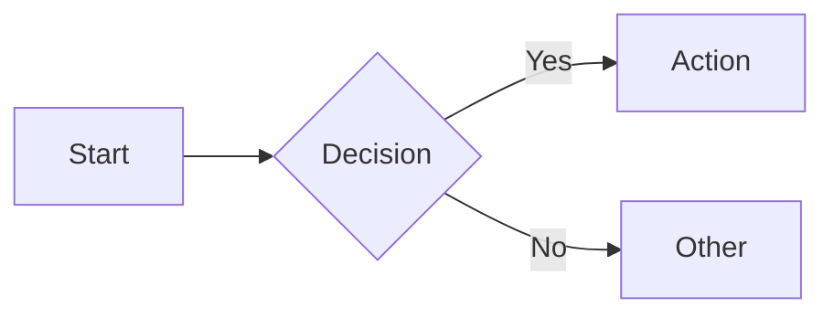

# Markdown Guidelines Loader

This skill detects the markdown rendering target for the current repository and loads the appropriate formatting guidelines. Other skills invoke this before writing or reviewing markdown content.

## Shared Skills

This skill uses shared helper skills. Load each skill's reference file ONLY when the condition in "Load When" is met. If a shared skill is not installed, use the inline summary as a fallback.

| Skill | Load When | Inline Fallback |
|-------|-----------|-----------------|
| `/adk:communication` | when formatting the "Markdown Guidelines Loaded" summary for the caller | Lead with conclusion. Bullet points. No preamble. Concrete specifics over abstractions. |

The **invoking skill** owns workflow, preflight, output format, and review standards — follow that skill's Shared Skills and Reference Loading tables for those concerns.

## Reference Loading

Load content conditionally to minimize token usage:

| Content | Load When |
|---------|-----------|
| Pagesmith feature reference (this file) | `--target pagesmith` or pagesmith auto-detect |
| GitHub feature reference (this file) | `--target github` or GitHub auto-detect |
| Plain markdown feature reference (this file) | `--target plain` or default fallback |

## Help

When `--help` is passed, display this reference and stop.

### Parameters

| Parameter | Values | Default | Description |
|-----------|--------|---------|-------------|
| `--target` | `pagesmith`, `github`, `plain` | auto-detect | Force a specific rendering target |

### Behavior Variations

- **Auto-detect** (default): infers the target from project configuration files and git remote
- **`--target <target>`**: overrides auto-detection and loads guidelines for the specified target
- Detection runs in order: pagesmith → GitHub → plain (first match wins)

### Examples

```
(invoked automatically by /adk:docs-write, /adk:docs-review, /adk:spec)
/adk:docs-md --target pagesmith
/adk:docs-md --target github
```

---

## Workflow

This is a helper skill invoked by other skills, not directly by users. It does not own the workflow — the invoking skill does.

## Target Detection

Determine the rendering target from project configuration, git remote, or explicit `--target` flag.

### Detection Logic

Run these checks in order. First match wins.

1. **Pagesmith**: check for `pagesmith.config.json5` or `pagesmith.config.json` in the repo root or any parent directory
2. **GitHub**: check for `.github/` directory OR a git remote URL containing `github.com`
3. **Plain**: default when neither pagesmith nor GitHub is detected

### Flag Override

When `--target` is passed, skip detection and use the specified target directly.

---

## Feature Reference by Target

### Pagesmith

Full feature set provided by `@pagesmith/core`. Use all of these when writing for a pagesmith site.

#### GFM Extensions

- **Tables**: pipe-delimited with header separator row
- **Strikethrough**: `~~deleted text~~`
- **Task lists**: `- [ ] unchecked` and `- [x] checked`
- **Autolinks**: bare URLs and email addresses auto-link
- **Footnotes**: `[^1]` reference with `[^1]: definition` at the bottom

#### GitHub-Style Alerts

Five alert types rendered as styled callout blocks:

```markdown
> [!NOTE]
> Supplementary information the reader should be aware of.

> [!TIP]
> Optional advice to help the reader succeed.

> [!IMPORTANT]
> Key information the reader needs to know.

> [!WARNING]
> Urgent information demanding immediate attention.

> [!CAUTION]
> Negative potential consequences of an action.
```

#### Math

Rendered via remark-math + rehype-mathjax:

- **Inline**: `$E = mc^2$`
- **Display block**: `$$\sum_{i=1}^{n} x_i$$`

#### Expressive Code

Syntax-highlighted code blocks with dual themes and rich features:

- **Language tag**: always include the language after opening fences
- **Title**: `title="filename.ts"` — displays a filename header above the block
- **Line numbers**: `showLineNumbers` — adds line numbers to the gutter
- **Line marking**: `mark={1,3-5}` — highlights specific lines
- **Insertions**: `ins={2}` — marks lines as added (green)
- **Deletions**: `del={4}` — marks lines as removed (red)
- **Collapse**: `collapse={6-20}` — collapses a range of lines behind an expand toggle
- **Copy button**: auto-included on all code blocks

Example:

````markdown
```typescript title="auth.ts" showLineNumbers mark={3} ins={7-8}
import { verify } from './jwt';

export function authenticate(token: string) {
  const payload = verify(token);
  if (!payload) throw new UnauthorizedError();

  // Added: check expiration
  if (payload.exp < Date.now() / 1000) throw new TokenExpiredError();

  return payload;
}
```
````

#### Smart Typography

Automatic typographic improvements:

- `"straight quotes"` → "curly quotes"
- `--` → em dashes
- `...` → ellipses

#### External Links

All external links automatically receive `target="_blank"` and `rel="noopener noreferrer"`.

#### Heading IDs and Anchors

Headings automatically generate slug-based IDs. Anchor links work via `[link text](#heading-slug)`.

#### Accessible Emoji

Emoji characters are wrapped with accessible `role="img"` and `aria-label` attributes.

#### Frontmatter

Only add frontmatter when `pagesmith.config.json5` or `pagesmith.config.json` exists. Available fields:

```yaml
---
title: "Page Title"
description: "SEO and social description"
navLabel: "Short Nav Label"
sidebarLabel: "Sidebar Label"
order: 10
draft: true
socialImage: "./og-image.png"
layout: "doc"
---
```

- `title` — page title, used in `<title>` and `<h1>` if no `# heading` exists
- `description` — meta description for SEO and social cards
- `navLabel` — short label for top navigation (when different from title)
- `sidebarLabel` — short label for sidebar navigation
- `order` — numeric sort order within the section
- `draft` — when `true`, page is excluded from production builds
- `socialImage` — relative path to Open Graph image
- `layout` — page layout template (`doc`, `blog`, `landing`, etc.)

#### Content Structure

- Use `folder/README.md` as the section index page
- Use `meta.json5` within a folder to control section ordering and metadata

#### Pipeline Order (Reference)

Content flows through: remark-gfm → remark-math → remark-smartypants → remark-github-alerts → rehype-mathjax → rehype-expressive-code → rehype-external-links → rehype-slug → rehype-autolink-headings → rehype-accessible-emojis

---

### GitHub

Standard GitHub-Flavored Markdown as rendered on github.com — READMEs, PRs, issues, wikis, and discussions.

#### GFM Extensions

- **Tables**: pipe-delimited with header separator row
- **Strikethrough**: `~~deleted text~~`
- **Task lists**: `- [ ]` and `- [x]`
- **Autolinks**: bare URLs auto-link
- **Footnotes**: `[^1]` reference with `[^1]: definition`

#### GitHub-Style Alerts

All five types supported and rendered natively:

```markdown
> [!NOTE]
> Supplementary information.

> [!TIP]
> Optional advice.

> [!IMPORTANT]
> Key information.

> [!WARNING]
> Urgent information.

> [!CAUTION]
> Negative consequences.
```

#### Mermaid Diagrams

Rendered natively by GitHub inside fenced code blocks:

````markdown

````

#### Math

Rendered by GitHub's MathJax integration:

- **Inline**: `$E = mc^2$`
- **Display block**: `$$\sum_{i=1}^{n} x_i$$`

#### Syntax Highlighting

Standard fenced code blocks with language tags. No expressive code features (no titles, line marks, or line numbers).

#### Frontmatter

Do not add YAML frontmatter unless explicitly requested. GitHub renders frontmatter as a table at the top of the document — only use it when the invoking skill specifically needs metadata.

---

### Plain Markdown

Standard CommonMark with minimal GFM extensions. Target for documentation tools, static sites without advanced plugins, or any unknown renderer.

#### Supported Features

- **Headings**: ATX-style (`#` through `######`)
- **Emphasis**: `*italic*`, `**bold**`, `***bold italic***`
- **Lists**: ordered and unordered, with nesting
- **Links**: inline `[text](url)` and reference-style `[text][ref]`
- **Images**: ``
- **Blockquotes**: `> quoted text`
- **Horizontal rules**: `---`
- **Code**: inline `` `code` `` and fenced code blocks with language tags
- **Tables**: pipe-delimited GFM tables (widely supported)
- **Strikethrough**: `~~text~~` (widely supported)

#### Not Available

- No GitHub alerts (`> [!NOTE]` etc.) — use bold text in blockquotes as fallback: `> **Note:** ...`
- No math rendering unless the invoking skill confirms MathJax/KaTeX support
- No mermaid rendering
- No expressive code features
- No smart typography

#### Frontmatter

Do not add frontmatter unless the invoking skill explicitly requests it.

---

## Output

Produce a summary listing the detected target and available features. The calling skill uses this to constrain its markdown output.

```text
## Markdown Guidelines Loaded

Target: pagesmith (detected via pagesmith.config.json5)

Available features:
- GFM: tables, strikethrough, task lists, autolinks, footnotes
- Alerts: NOTE, TIP, IMPORTANT, WARNING, CAUTION
- Math: inline ($) and display ($$)
- Expressive Code: titles, line numbers, mark/ins/del, collapse
- Smart typography: curly quotes, em dashes, ellipses
- Frontmatter: title, description, navLabel, sidebarLabel, order, draft, socialImage, layout
```
