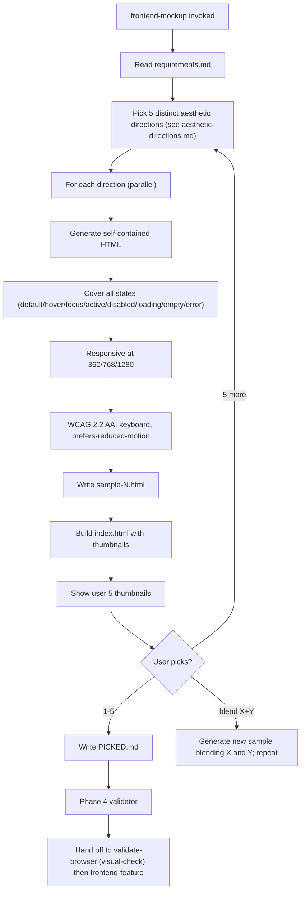
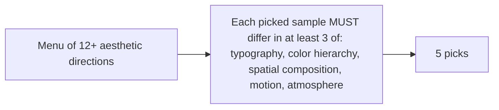

# `frontend-mockup` — how it works

```mermaid
flowchart TD
    Start["frontend-mockup invoked"] --> ReadReq["Read requirements.md"]
    ReadReq --> Pick5["Pick 5 distinct aesthetic directions (see aesthetic-directions.md)"]
    Pick5 --> Loop["For each direction (parallel)"]
    Loop --> Gen["Generate self-contained HTML"]
    Gen --> States["Cover all states (default/hover/focus/active/disabled/loading/empty/error)"]
    States --> Resp["Responsive at 360/768/1280"]
    Resp --> A11y["WCAG 2.2 AA, keyboard, prefers-reduced-motion"]
    A11y --> Write["Write sample-N.html"]
    Write --> Index["Build index.html with thumbnails"]
    Index --> Show["Show user 5 thumbnails"]
    Show --> Decide{"User picks?"}
    Decide -- "1-5" --> Picked["Write PICKED.md"]
    Decide -- "5 more" --> Pick5
    Decide -- "blend X+Y" --> NewDir["Generate new sample blending X and Y; repeat"]
    Picked --> Validate["Phase 4 validator"]
    Validate --> Handoff["Hand off to validate-browser (visual-check) then frontend-feature"]
```

## Diversity guarantee

```mermaid
flowchart LR
    Menu["Menu of 12+ aesthetic directions"] --> Constraint["Each picked sample MUST differ in at least 3 of: typography, color hierarchy, spatial composition, motion, atmosphere"]
    Constraint --> Output["5 picks"]
```
