# Mermaid Diagram Generation

Generate diagrams using Mermaid syntax. Supports all 20+ Mermaid v11 diagram types with proper syntax, theming, and SVG rendering via `mmdc`.

## Prerequisites

| Tool | Install Command | Purpose |
|------|----------------|---------|
| `mmdc` | `npm install -g @mermaid-js/mermaid-cli` | Render `.mermaid` → SVG/PNG |

If `mmdc` is not available, save the `.mermaid` source file and inform the user. The source can be pasted into [mermaid.live](https://mermaid.live) or rendered later.

## Workflow

### Phase 1: Determine Diagram Type

If `type` is not specified, auto-detect from the description (see orchestrator skill for detection rules). If `type` is specified, use it directly.

### Phase 2: Generate Mermaid Source

Write a `.mermaid` file following the syntax reference below. Apply these quality standards:

1. **Clear labels**: Use descriptive text, not single letters (e.g., `API Gateway` not `A`).
2. **Meaningful IDs**: Use readable IDs like `api_gateway` not `A`.
3. **Proper spacing**: Use subgraphs to group related components.
4. **Visual hierarchy**: Important nodes should be visually prominent.
5. **Readable flow**: Prefer `TD` for hierarchies, `LR` for sequences/timelines.
6. **Theme compatibility**: Avoid hardcoded colors unless necessary. Use `classDef` for styling.
7. **Comments**: Add a header comment with the diagram title.

File header:
```
%% Diagram: <title>
%% Type: <diagram-type>
%% Generated by Claude Devkit
```

### Phase 3: Render to SVG

```bash
mmdc -i <input>.mermaid -o <output>.svg -b transparent -t <theme>
```

Options:
- `-b transparent` — Transparent background (works in both light and dark contexts).
- `-t <theme>` — Use the specified theme (default: `default`).
- `-w 1200` — Optional: set viewport width for larger diagrams.

If `format=jpeg` or the caller requests JPEG, first render to SVG, then use the `/image-transform` skill to convert SVG→JPEG.

### Phase 4: Output

Save files to the output directory:
- `<name>.mermaid` — Source file
- `<name>.svg` — Rendered SVG
- `<name>.jpg` — JPEG (only if `format=jpeg` or `format=both`)

Report:
```
Mermaid diagram generated:
  Source: ./diagrams/auth-flow.mermaid
  SVG:    ./diagrams/auth-flow.svg

Embed in markdown:
  

Or inline:
  ```mermaid
  <source>
  ```
```

---

## Diagram Type Reference

### Flowchart

**Directive:** `flowchart TD` (or `LR`, `BT`, `RL`)

**Directions:** `TB`/`TD` (top-down), `BT` (bottom-top), `LR` (left-right), `RL` (right-left)

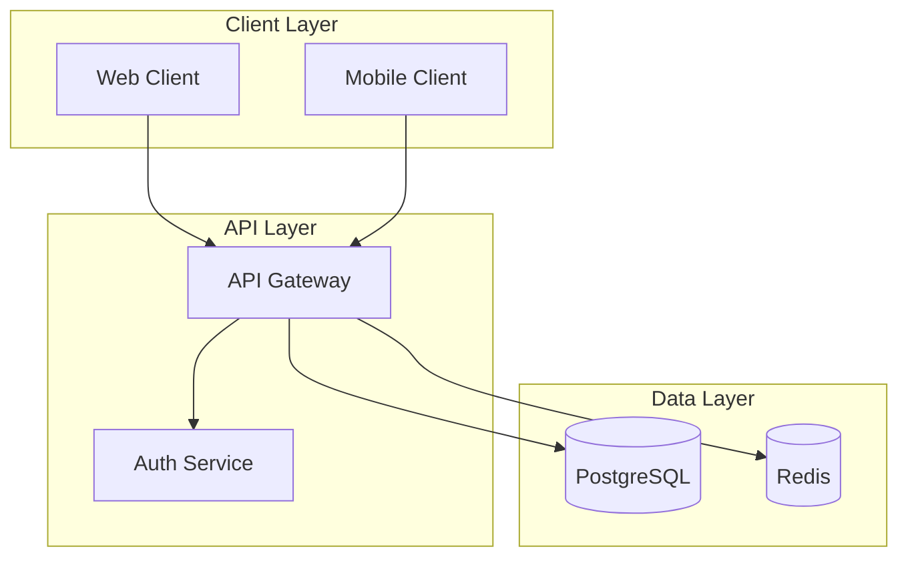

**Node shapes:**
- `[text]` — Rectangle (process)
- `(text)` — Rounded rectangle
- `{text}` — Rhombus (decision)
- `[(text)]` — Cylinder (database)
- `((text))` — Circle
- `>text]` — Asymmetric
- `[[text]]` — Subroutine
- `{{text}}` — Hexagon

**Edge types:**
- `-->` — Arrow
- `---` — Line
- `-.->` — Dotted arrow
- `==>` — Thick arrow
- `--text-->` — Arrow with label
- `-->|text|` — Arrow with label (alternative)

**Best practices:**
- Use `flowchart` (not `graph`) for modern features.
- Avoid `end` as a node ID (use `End` or wrap in quotes).
- Use subgraphs for logical grouping.
- Use `classDef` for consistent styling across nodes.

---

### Sequence Diagram

**Directive:** `sequenceDiagram`

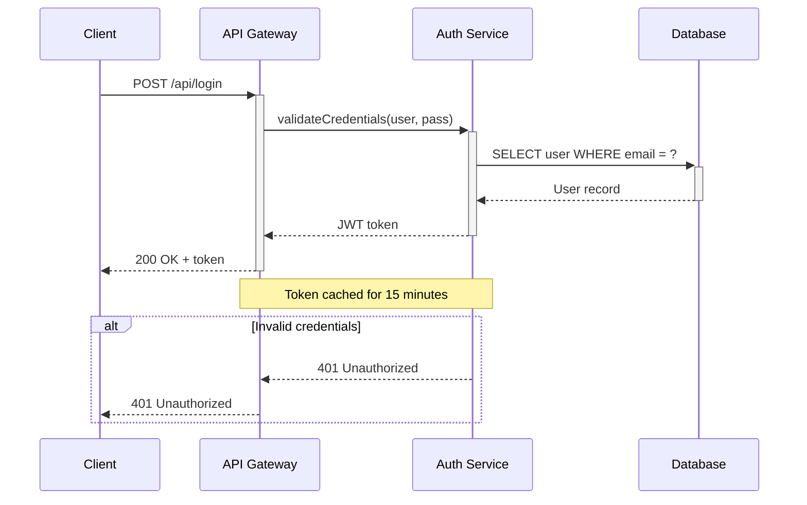

**Arrow types:**
| Syntax | Description |
|--------|-------------|
| `->` | Solid line, no arrow |
| `-->` | Dotted line, no arrow |
| `->>` | Solid line, arrowhead |
| `-->>` | Dotted line, arrowhead |
| `-x` | Solid line, cross |
| `--x` | Dotted line, cross |
| `-)` | Solid line, open arrow (async) |
| `--)` | Dotted line, open arrow (async) |

**Features:** `activate`/`deactivate` (or `+`/`-` suffixes), `alt`/`else`, `opt`, `par`, `critical`, `break`, `loop`, `rect` (background highlight), `autonumber`, `Note over`/`Note left of`/`Note right of`.

**Best practices:**
- Declare participants explicitly to control ordering.
- Use `autonumber` for complex flows.
- Use `+`/`-` suffixes for activation rather than separate `activate`/`deactivate` lines.
- Include error paths with `alt`/`else` blocks.

---

### Class Diagram

**Directive:** `classDiagram`

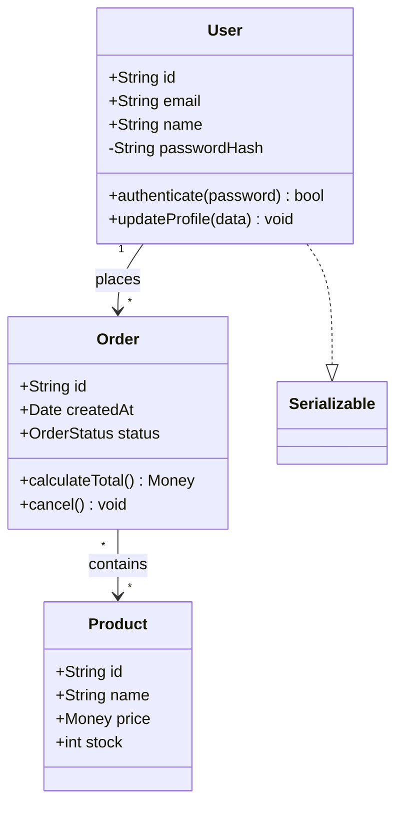

**Relationships:**
| Syntax | Meaning |
|--------|---------|
| `<\|--` | Inheritance |
| `*--` | Composition |
| `o--` | Aggregation |
| `-->` | Association |
| `--` | Link (solid) |
| `..>` | Dependency |
| `..\|>` | Realization |
| `..` | Link (dashed) |

**Features:** Annotations (`<<interface>>`, `<<abstract>>`, `<<enumeration>>`), visibility (`+` public, `-` private, `#` protected, `~` package), generic types, namespaces.

---

### State Diagram

**Directive:** `stateDiagram-v2`

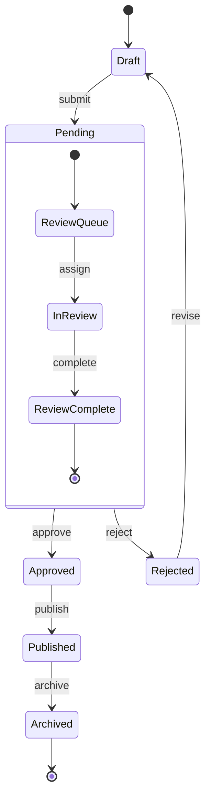

**Features:** `[*]` for start/end states, composite states, `<<fork>>`, `<<join>>`, `<<choice>>`, notes, concurrency with `--`.

**Best practices:** Use `stateDiagram-v2` (not v1). Use composite states for nested state machines.

---

### Entity Relationship Diagram

**Directive:** `erDiagram`

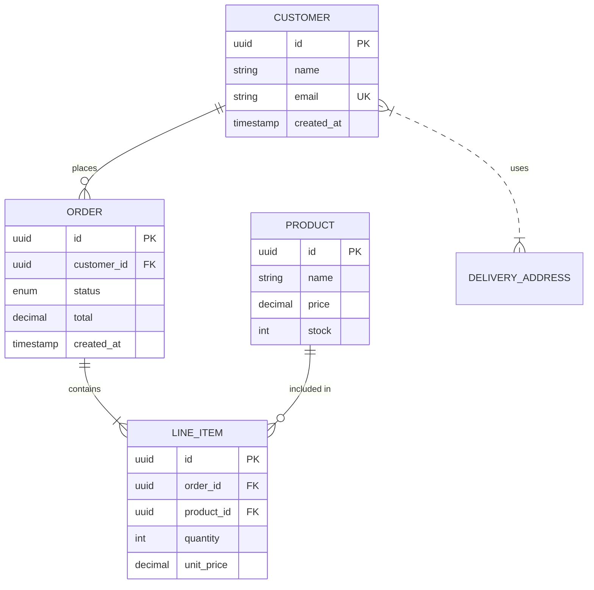

**Cardinality:**
| Symbol | Meaning |
|--------|---------|
| `\|\|` | Exactly one |
| `o\|` | Zero or one |
| `}\|` | One or more |
| `o{` | Zero or more |

Solid lines (`--`) = identifying relationships. Dashed lines (`..`) = non-identifying.

---

### Gantt Chart

**Directive:** `gantt`

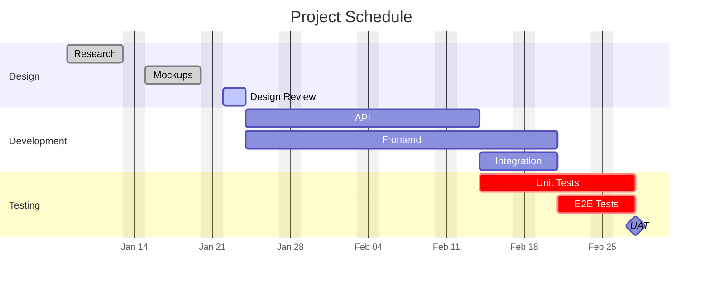

**Tags:** `done`, `active`, `crit`, `milestone`. Use `after taskId` for dependencies.

---

### GitGraph

**Directive:** `gitGraph`

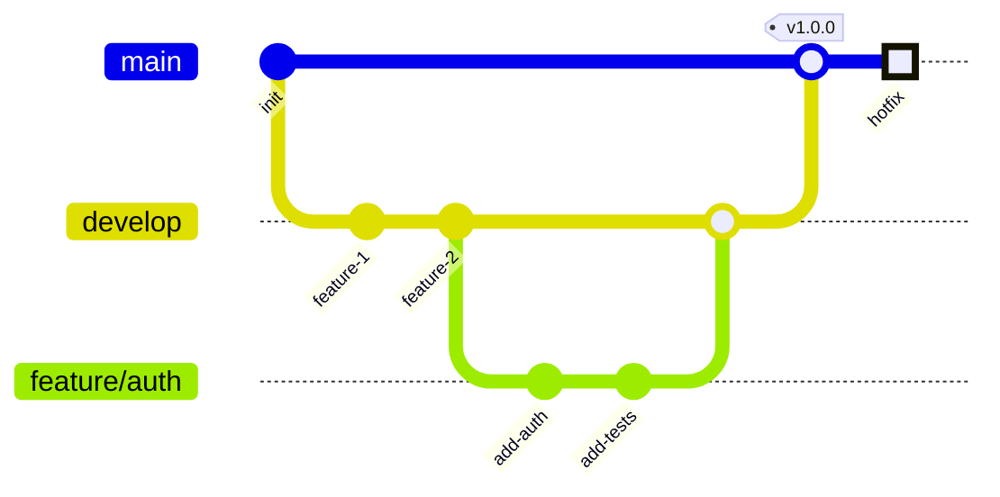

**Commands:** `commit`, `branch`, `checkout`/`switch`, `merge`, `cherry-pick`. Commit options: `id:`, `msg:`, `tag:`, `type:` (NORMAL/REVERSE/HIGHLIGHT).

---

### Mindmap

**Directive:** `mindmap`

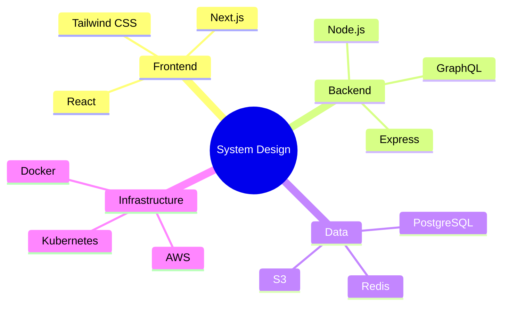

**Node shapes:** `()` rounded, `(())` circle, `[()]` cylinder, `[]` square, `))` bang, `{{}}` hexagon. Hierarchy via relative indentation.

---

### Timeline

**Directive:** `timeline`

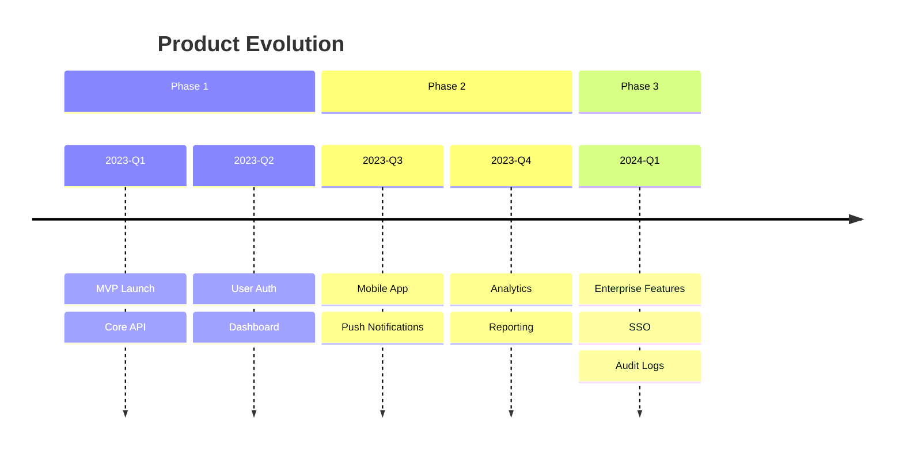

---

### C4 Diagrams

**Directives:** `C4Context`, `C4Container`, `C4Component`, `C4Dynamic`, `C4Deployment`

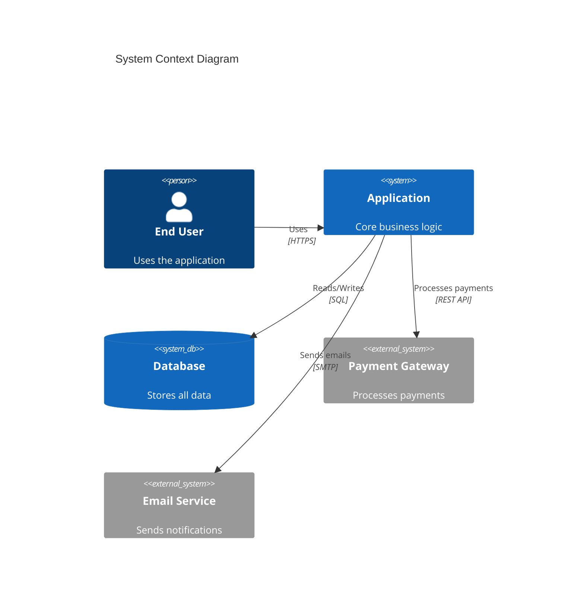

**Elements:** `Person`, `Person_Ext`, `System`, `System_Ext`, `SystemDb`, `SystemDb_Ext`, `SystemQueue`, `Boundary`, `Container`, `Component`.

**Note:** C4 diagrams are experimental. Syntax may change.

---

### Architecture Diagram (v11.1+)

**Directive:** `architecture-beta`

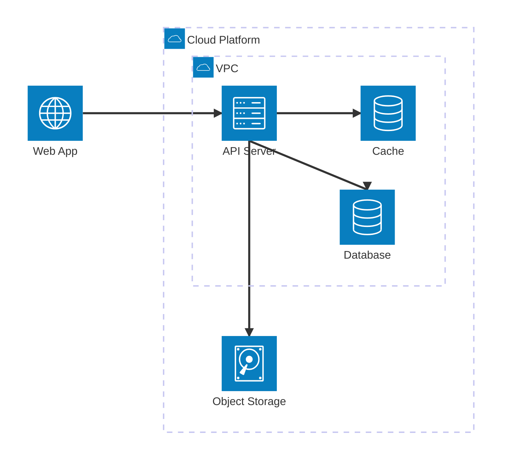

**Built-in icons:** `cloud`, `database`, `disk`, `internet`, `server`. Use `--iconPacks` for additional icons from iconify.design.

**Port directions:** `L` (left), `R` (right), `T` (top), `B` (bottom).

---

### Kanban (v11.4+)

**Directive:** `kanban`

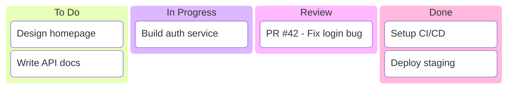

**Features:** Metadata via `@{ assigned: "Alice", priority: "High" }`.

---

### Quadrant Chart

**Directive:** `quadrantChart`

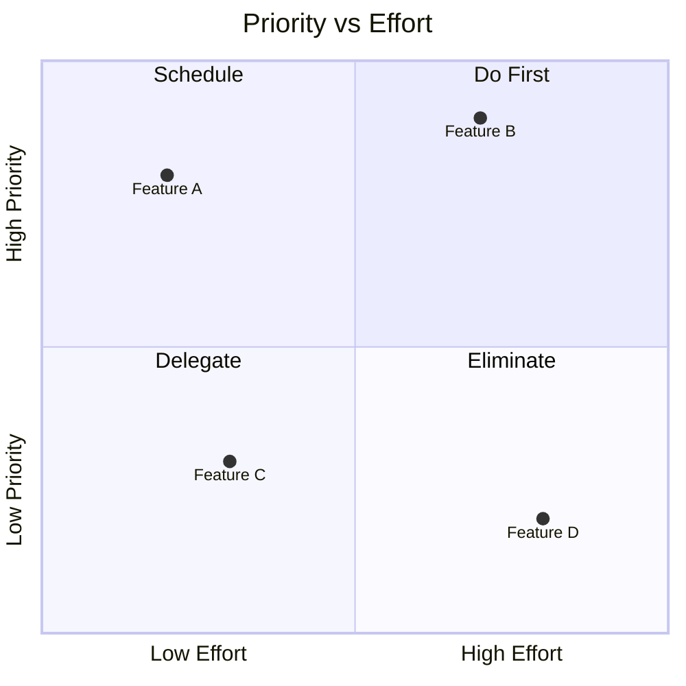

Quadrant numbering: 1=top-right, 2=top-left, 3=bottom-left, 4=bottom-right. Point coordinates: `[x, y]` in 0-1 range.

---

### Sankey Diagram

**Directive:** `sankey-beta`

```
sankey-beta

Source A,Process 1,40
Source A,Process 2,30
Source B,Process 1,20
Process 1,Output,50
Process 2,Output,35
```

CSV format: source, target, value. Blank line after directive is required.

---

### XY Chart

**Directive:** `xychart-beta`

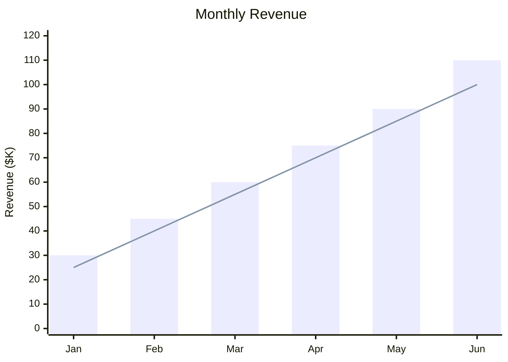

---

### Packet Diagram (v11+)

**Directive:** `packet-beta`

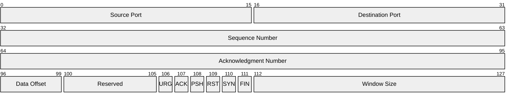

Bit-range notation: `start-end: "Label"`.

---

### User Journey

**Directive:** `journey`

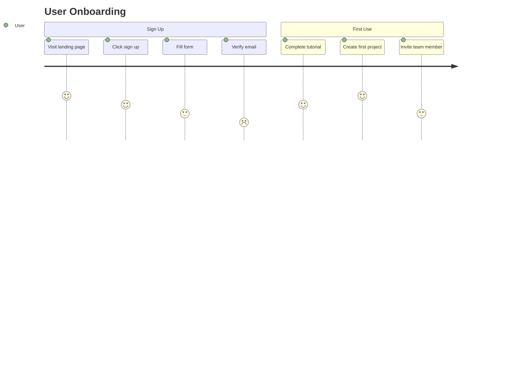

Tasks have a happiness score (1-5) and actor assignment.

---

### Pie Chart

**Directive:** `pie`

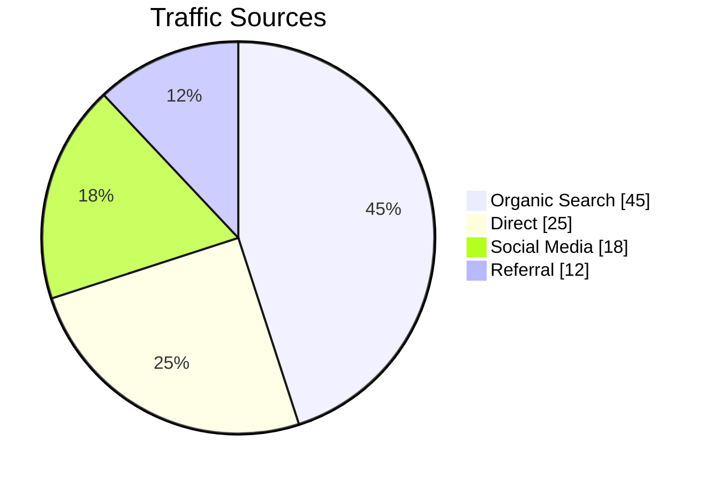

---

## Theming and Configuration

### Built-in Themes

| Theme | Use Case |
|-------|----------|
| `default` | General purpose, good contrast |
| `forest` | Green-toned, nature-inspired |
| `dark` | Dark backgrounds / dark mode |
| `neutral` | Black and white, ideal for print |
| `base` | Foundation for custom themes (only customizable theme) |

### Custom Theme via Frontmatter

```
---
config:
  theme: base
  themeVariables:
    primaryColor: "#4a90d9"
    primaryTextColor: "#ffffff"
    primaryBorderColor: "#2c5f8a"
    lineColor: "#333333"
    secondaryColor: "#f0f4f8"
    tertiaryColor: "#e8f5e9"
---
flowchart TD
    A --> B
```

**Important:** Theme engine only recognizes hex colors (`#ff0000`), not color names (`red`).

### Config File for mmdc

```json
{
  "theme": "default",
  "flowchart": { "curve": "basis" },
  "sequence": { "mirrorActors": false }
}
```

Usage: `mmdc -i input.mermaid -o output.svg -c config.json`

## Known Limitations

1. **Character/size limits**: Some platforms cap at ~5000 bytes.
2. **"Too many edges" error**: Very large flowcharts crash the renderer.
3. **Reserved words**: `end`, `default` cannot be bare node IDs — capitalize or quote.
4. **Self-loops**: Render poorly compared to Graphviz.
5. **Beta types** (`sankey-beta`, `architecture-beta`, etc.): May have breaking changes.
6. **Theme engine**: Only accepts hex colors, not color names.
7. **Puppeteer dependency**: mmdc uses headless Chromium. May need `--no-sandbox` in Docker/CI.

## Composability

This skill is called by:
- **`/diagram`** orchestrator — when Mermaid is the selected engine.
- **`/doc-write`** — for diagrams in documents.
- **`/pr-review`** — for visual PR summaries.
- **`/research`** — for visualizing research findings.
- Other skills that need structured diagrams.

When producing JPEG output (e.g., for Confluence), delegate to `/image-transform` after rendering SVG.
