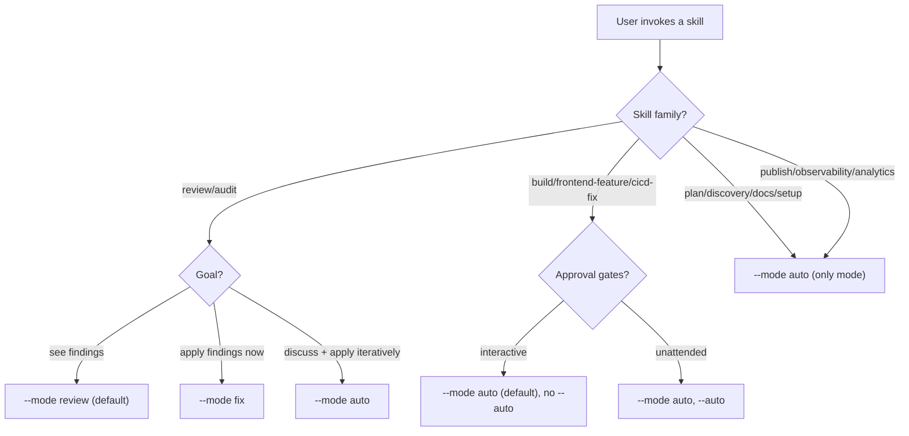
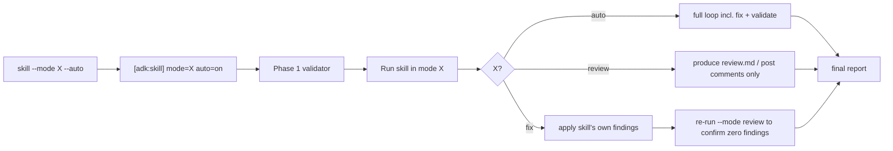

# `mode-contract` — how it works

## Mode-pick decision tree

```mermaid
flowchart TD
    Start["User invokes a skill"] --> Q1{"Skill family?"}
    Q1 -- "review/audit" --> Q2{"Goal?"}
    Q2 -- "see findings" --> Review["--mode review (default)"]
    Q2 -- "apply findings now" --> Fix["--mode fix"]
    Q2 -- "discuss + apply iteratively" --> Auto["--mode auto"]
    Q1 -- "build/frontend-feature/cicd-fix" --> Q3{"Approval gates?"}
    Q3 -- "interactive" --> Auto2["--mode auto (default), no --auto"]
    Q3 -- "unattended" --> AutoFlag["--mode auto, --auto"]
    Q1 -- "plan/discovery/docs/setup" --> AutoOnly["--mode auto (only mode)"]
    Q1 -- "publish/observability/analytics" --> AutoOnly
```

## Mode lifecycle

```mermaid
flowchart LR
    Invoke["skill --mode X --auto"] --> Banner["[adk:skill] mode=X auto=on"]
    Banner --> Phase1["Phase 1 validator"]
    Phase1 --> Run["Run skill in mode X"]
    Run --> Modal{"X?"}
    Modal -- "auto" --> FullLoop["full loop incl. fix + validate"]
    Modal -- "review" --> Findings["produce review.md / post comments only"]
    Modal -- "fix" --> Apply["apply skill's own findings"]
    Apply --> Revalidate["re-run --mode review to confirm zero findings"]
    FullLoop --> Final["final report"]
    Findings --> Final
    Revalidate --> Final
```
