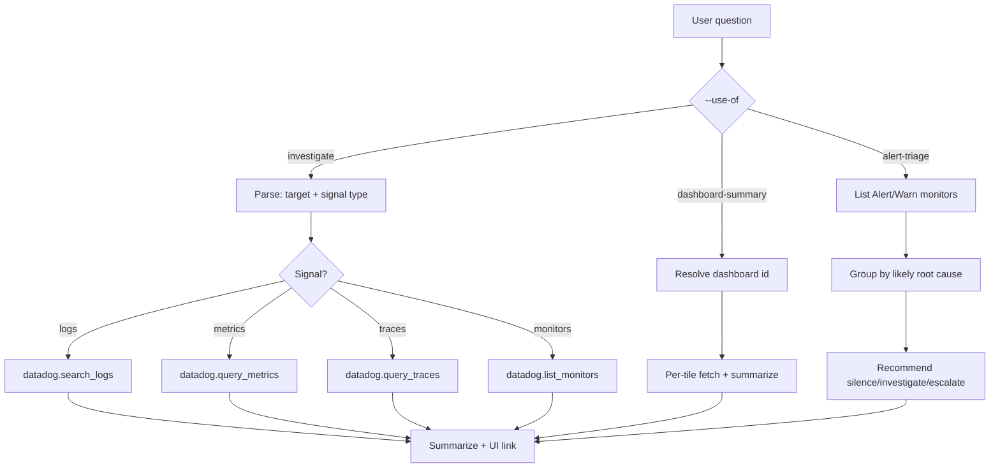
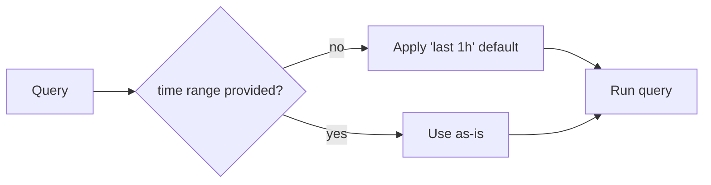

# `observability-datadog` — how it works

```mermaid
flowchart TD
    Q["User question"] --> Use{"--use-of"}
    Use -- "investigate" --> Inv
    Use -- "dashboard-summary" --> Ds
    Use -- "alert-triage" --> At

    Inv["Parse: target + signal type"] --> Pick{"Signal?"}
    Pick -- "logs" --> SLogs["datadog.search_logs"]
    Pick -- "metrics" --> SMet["datadog.query_metrics"]
    Pick -- "traces" --> STr["datadog.query_traces"]
    Pick -- "monitors" --> SMon["datadog.list_monitors"]
    SLogs --> Sum
    SMet --> Sum
    STr --> Sum
    SMon --> Sum
    Sum["Summarize + UI link"]

    Ds["Resolve dashboard id"] --> Tiles["Per-tile fetch + summarize"]
    Tiles --> Sum

    At["List Alert/Warn monitors"] --> Group["Group by likely root cause"]
    Group --> Reco["Recommend silence/investigate/escalate"]
    Reco --> Sum
```

## Time-range guard

```mermaid
flowchart LR
    Q["Query"] --> TR{"time range provided?"}
    TR -- no --> Default["Apply 'last 1h' default"]
    TR -- yes --> Use["Use as-is"]
    Default --> Run
    Use --> Run["Run query"]
```
