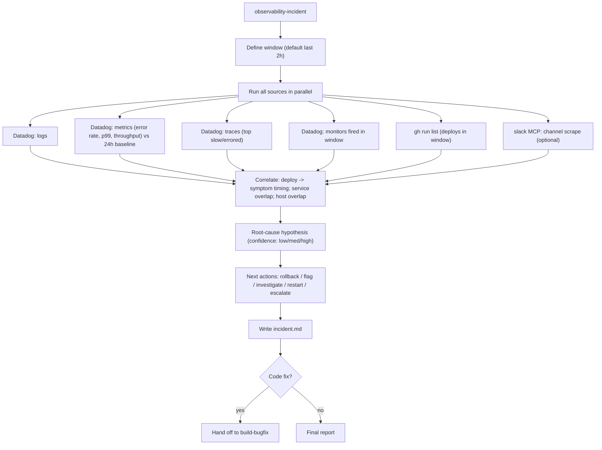

# `observability-incident` — how it works

```mermaid
flowchart TD
    Start["observability-incident"] --> Window["Define window (default last 2h)"]
    Window --> Parallel
    Parallel["Run all sources in parallel"] --> DD1["Datadog: logs"]
    Parallel --> DD2["Datadog: metrics (error rate, p99, throughput) vs 24h baseline"]
    Parallel --> DD3["Datadog: traces (top slow/errored)"]
    Parallel --> DD4["Datadog: monitors fired in window"]
    Parallel --> Gh["gh run list (deploys in window)"]
    Parallel --> Slack["slack MCP: channel scrape (optional)"]
    DD1 --> Correlate
    DD2 --> Correlate
    DD3 --> Correlate
    DD4 --> Correlate
    Gh --> Correlate
    Slack --> Correlate
    Correlate["Correlate: deploy -> symptom timing; service overlap; host overlap"] --> Hypo["Root-cause hypothesis (confidence: low/med/high)"]
    Hypo --> Actions["Next actions: rollback / flag / investigate / restart / escalate"]
    Actions --> Write["Write incident.md"]
    Write --> Handoff{"Code fix?"}
    Handoff -- yes --> Bugfix["Hand off to build-bugfix"]
    Handoff -- no --> Done["Final report"]
```
