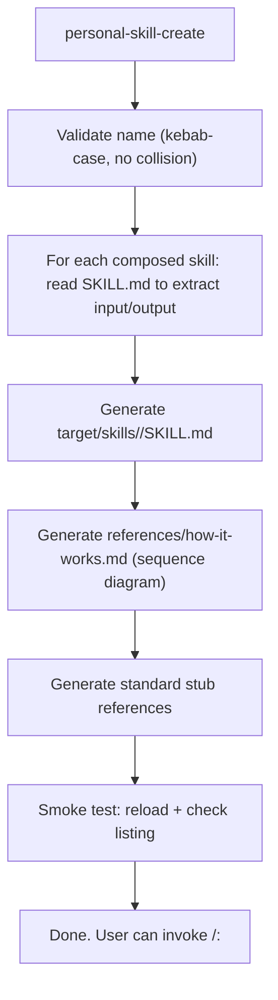
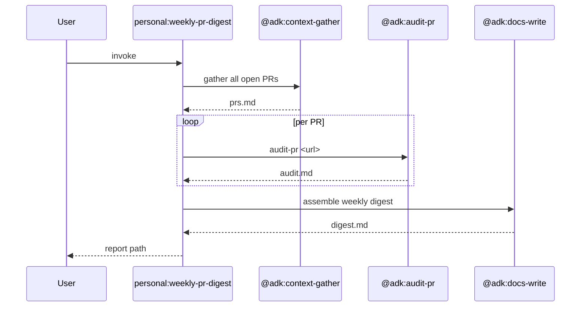

# `personal-skill-create` — how it works

```mermaid
flowchart TD
    Start["personal-skill-create"] --> Validate["Validate name (kebab-case, no collision)"]
    Validate --> Read["For each composed skill: read SKILL.md to extract input/output"]
    Read --> Gen["Generate target/skills/<name>/SKILL.md"]
    Gen --> How["Generate references/how-it-works.md (sequence diagram)"]
    How --> Stubs["Generate standard stub references"]
    Stubs --> Smoke["Smoke test: reload + check listing"]
    Smoke --> Done["Done. User can invoke /<install-target>:<name>"]
```

## Composition pattern

```mermaid
sequenceDiagram
    participant User
    participant Personal as personal:weekly-pr-digest
    participant CG as @adk:context-gather
    participant AP as @adk:audit-pr
    participant DW as @adk:docs-write

    User->>Personal: invoke
    Personal->>CG: gather all open PRs
    CG-->>Personal: prs.md
    loop per PR
      Personal->>AP: audit-pr <url>
      AP-->>Personal: audit.md
    end
    Personal->>DW: assemble weekly digest
    DW-->>Personal: digest.md
    Personal-->>User: report path
```
