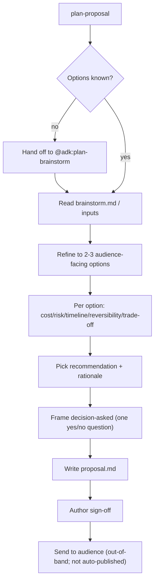

# `plan-proposal` — how it works

```mermaid
flowchart TD
    Start["plan-proposal"] --> Q{"Options known?"}
    Q -- no --> Brain["Hand off to @adk:plan-brainstorm"]
    Brain --> Read
    Q -- yes --> Read["Read brainstorm.md / inputs"]
    Read --> Refine["Refine to 2-3 audience-facing options"]
    Refine --> Capture["Per option: cost/risk/timeline/reversibility/trade-off"]
    Capture --> Pick["Pick recommendation + rationale"]
    Pick --> Frame["Frame decision-asked (one yes/no question)"]
    Frame --> Write["Write proposal.md"]
    Write --> Approve["Author sign-off"]
    Approve --> Send["Send to audience (out-of-band; not auto-published)"]
```
