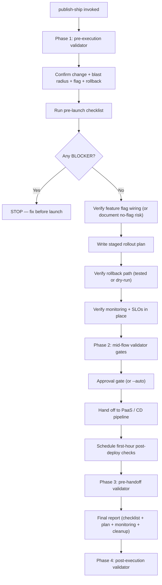

# `publish-ship` — how it works

## Decision flow

The actual deploy command is NOT run by this skill — it prepares for the deploy and watches the first hour. See `references/pre-launch-checklist.md`, `references/staged-rollout.md`, `references/feature-flag-lifecycle.md`, and `references/first-hour-checklist.md` for the playbooks.
