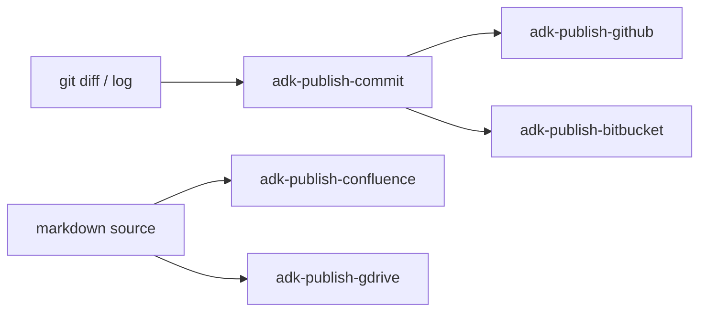

# ADK Publish (Category Router)

Routes any "ship this somewhere" intent to the right publishing task. Activate one of the listed task skills below; do not publish directly from this router.

## When to use this category

- Drafting and creating a git commit, a PR description, or a changelog entry.
- Creating, updating, commenting on, or merging a PR on GitHub or Bitbucket.
- Publishing a markdown document to Confluence.
- Sharing or updating a doc in Google Drive / Google Docs.

## When NOT to use this category

- Writing the doc / spec source material -> `@adk:docs-write` (a.k.a. `adk-docs-write`) / `@adk:plan-spec` (a.k.a. `adk-plan-spec`)
- Reviewing the code that is about to ship -> `@adk:review-local` (a.k.a. `adk-review-local`) / `@adk:review-pr` (a.k.a. `adk-review-pr`)
- Building or fixing the code -> `@adk:build` (a.k.a. `adk-build`)
- Configuring the publish destination MCP server -> manual MCP setup; this category assumes the MCP is configured

## Shared workflow

Every task in this category honors the same five steps. The task skills tailor the content of each step.

1. **Confirm intent** - identify destination (repo, remote, page, drive folder), artifact type, and convention (conventional commit, repo template, page template).
2. **Gather** - pull the source-of-truth: `git diff` / `git log` for commits and PRs, the markdown source for Confluence / Drive, or the existing remote artifact if updating.
3. **Draft** - produce the artifact in the destination's expected format. Approval gate before any remote write unless `--auto`.
4. **Execute** - run the publish action: `git commit`, `gh pr create`, MCP `confluence_publish`, MCP `gdrive_upload`, etc.
5. **Verify** - read back from the destination to confirm the artifact landed correctly. Report the URL, commit SHA, or page ID.

## Task selection

| Task skill | Use when | Do NOT use when |
| --- | --- | --- |
| `@adk:publish-commit` (a.k.a. `adk-publish-commit`) | Drafting commit messages, PR descriptions, or changelog entries from real diffs/history | Pushing the change to GitHub - use publish-github |
| `@adk:publish-github` (a.k.a. `adk-publish-github`) | GitHub PR/issue/comment/merge actions via `gh` CLI or `github` MCP | Bitbucket destination - use publish-bitbucket |
| `@adk:publish-bitbucket` (a.k.a. `adk-publish-bitbucket`) | Bitbucket Cloud PR/issue/comment/merge actions via REST API or `bitbucket` MCP | GitHub destination - use publish-github |
| `@adk:publish-confluence` (a.k.a. `adk-publish-confluence`) | Publishing a markdown doc as a Confluence page (new or update) | Internal repo doc - just write the markdown with docs-write |
| `@adk:publish-gdrive` (a.k.a. `adk-publish-gdrive`) | Sharing or updating a doc in Google Drive / Google Docs | Confluence destination - use publish-confluence |

## Destination matrix

## Convention defaults

- Commit messages default to conventional commits unless the repo's `git log` shows another consistent style. Match the repo, not your preference.
- PR titles match the commit-message convention. PR bodies follow `.github/PULL_REQUEST_TEMPLATE.md` when present.
- Changelogs follow Keep a Changelog by default. Match an existing `CHANGELOG.md` style if present.
- Confluence pages use ADK page titles `<Project> - <Topic>` unless the parent space dictates otherwise.

## MCP / CLI dependency

Each publishing task either calls a CLI (`git`, `gh`) or an MCP server (`github`, `bitbucket`, `atlassian-confluence`, `google-drive`). The task skill checks availability and falls back to instructions if the dependency is missing - it never silently no-ops.

## Activation

Once you have picked a task, load `adk-publish-<task>` and follow it. Each task skill is fully standalone - everything it needs is in its own folder.

## Anti-patterns

- Publishing inside this router. Always hand off to a task skill.
- Drafting a commit message before reading the diff.
- Hiding breaking changes in the body. Surface them.
- Auto-merging or force-pushing without explicit user approval.

## Clarifying questions (default-ask)

When running without `--auto`, the skill asks these questions in order, one at a time. Under `--auto`, the skill picks the safest option for each (see `references/publish-clarifying-questions.md`) and reports the choices.

1. **What is the destination?** — _How to pick:_ Local commit / PR-message draft → adk-publish-commit. GitHub action → adk-publish-github. Bitbucket → adk-publish-bitbucket. Confluence page → adk-publish-confluence. Google Drive doc → adk-publish-gdrive.

**Default report:** Routed task + why.

**Detailed report (on request or `--verbose`):** (n/a — small router)

**Artifact:** `publish-routing-decision` — Inline message.

**Artifact path:** (none)

## Clarifying questions (default-ask)

When running without `--auto`, the skill asks these questions in order, one at a time. Under `--auto`, the skill picks the safest option for each (see `references/publish-clarifying-questions.md`) and reports the choices.

1. **What is the destination?** — _How to pick:_ Local commit / PR-message draft → adk-publish-commit. GitHub action → adk-publish-github. Bitbucket → adk-publish-bitbucket. Confluence page → adk-publish-confluence. Google Drive doc → adk-publish-gdrive.

## Default vs detailed output

**Default report:** Routed task + why.

**Detailed report (on request or `--verbose`):** (n/a — small router)

**Artifact:** `publish-routing-decision` — Inline message.

**Artifact path:** (none)

<!-- adk:references:start -->

## References shipped with this skill

These files live in `references/` next to this `SKILL.md`. Read them when the skill activates; they are inlined here so the skill is fully self-contained (no cross-skill or shared sources).

| File | Purpose |
| --- | --- |
| `references/publish-anti-patterns.md` | Things to avoid when running this skill. |
| `references/publish-artifact-format.md` | The deliverable's format and where it lives (.temp/ contract). |
| `references/publish-clarifying-questions.md` | The default-ask questions for this skill, with how-to-pick rubrics. |
| `references/publish-constitution.md` | Non-negotiable rules and working/communication discipline. |
| `references/interaction-contract.md` | Default-ask, explained-options, --auto contract every skill must follow. |
| `references/publish-output-format.md` | Default vs detailed report shapes; severity labels; verbosity rules. |
| `references/publish-persona.md` | The agent persona that drives this skill. |
| `references/publish-validator.md` | The four-phase validator gate (pre-execution, mid-flow, pre-publish, post-publish) this skill MUST run. |

<!-- adk:references:end -->
