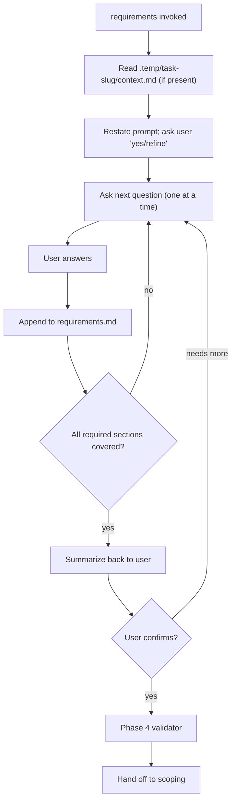

# `requirements` — how it works

```mermaid
flowchart TD
    Start["requirements invoked"] --> Read["Read .temp/task-slug/context.md (if present)"]
    Read --> Restate["Restate prompt; ask user 'yes/refine'"]
    Restate --> AskNext["Ask next question (one at a time)"]
    AskNext --> User["User answers"]
    User --> Capture["Append to requirements.md"]
    Capture --> Done{"All required sections covered?"}
    Done -- no --> AskNext
    Done -- yes --> Summarize["Summarize back to user"]
    Summarize --> Confirm{"User confirms?"}
    Confirm -- "needs more" --> AskNext
    Confirm -- "yes" --> Validate["Phase 4 validator"]
    Validate --> Handoff["Hand off to scoping"]
```

## Question pacing

```mermaid
flowchart LR
    Q1["Q1: outcome"] --> Q2["Q2: users"]
    Q2 --> Q3["Q3: triggers"]
    Q3 --> Q4["Q4: behavior"]
    Q4 --> Q5["Q5: inputs/outputs"]
    Q5 --> Q6["Q6: success measures"]
    Q6 --> Q7["Q7: must-haves"]
    Q7 --> Q8["Q8: nice-to-haves"]
    Q8 --> Q9["Q9: NON-GOALS (critical)"]
    Q9 --> Q10["Q10: edge cases"]
    Q10 --> Q11["Q11: constraints"]
    Q11 --> Q12["Q12: open questions"]
```

Skip any question whose answer is unambiguous from the context.md / prompt.
