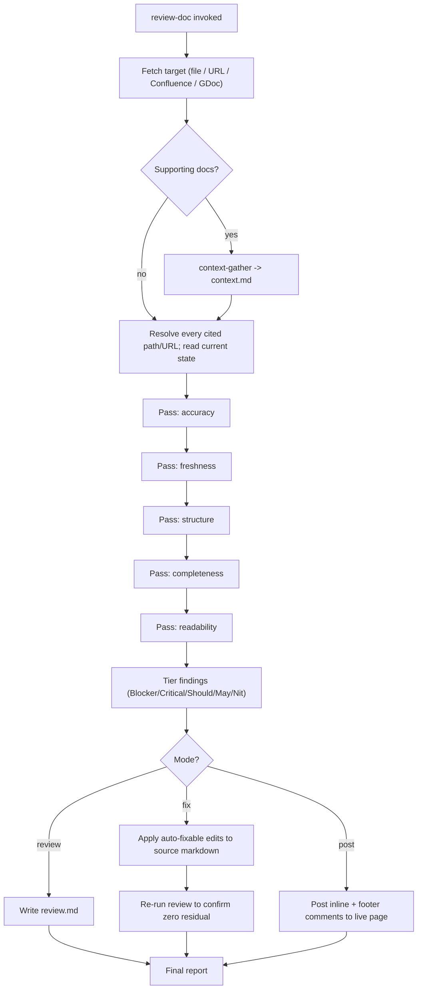
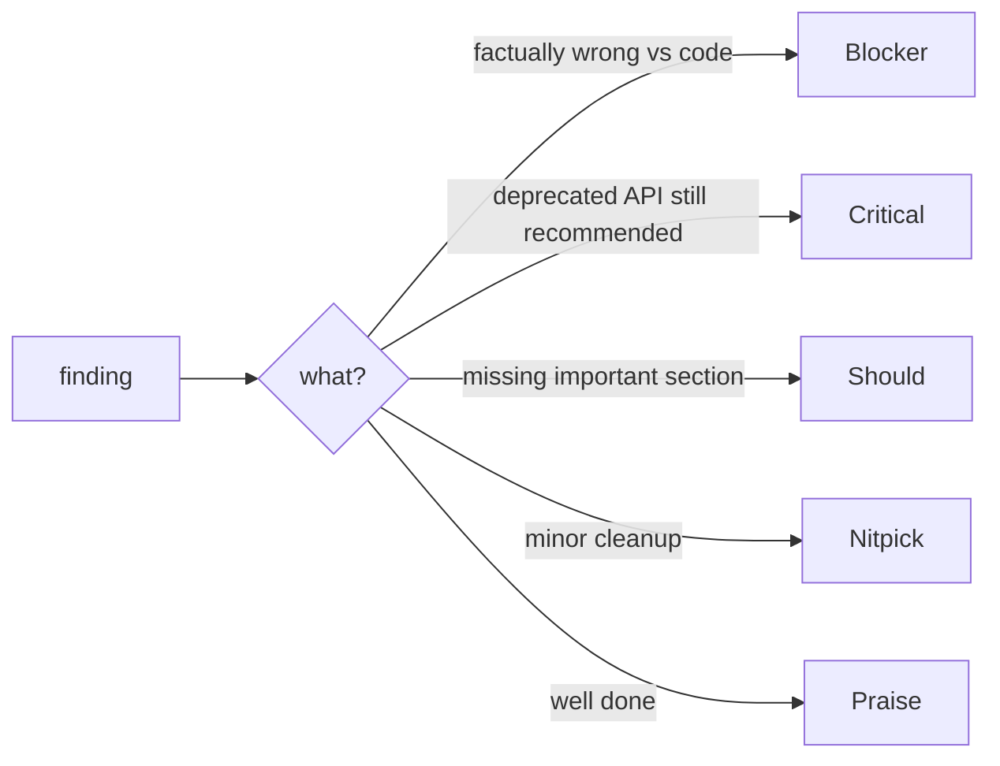

# `review-doc` — how it works

```mermaid
flowchart TD
    Start["review-doc invoked"] --> Fetch["Fetch target (file / URL / Confluence / GDoc)"]
    Fetch --> Sup{"Supporting docs?"}
    Sup -- yes --> CG["context-gather -> context.md"]
    Sup -- no --> ReadCode
    CG --> ReadCode["Resolve every cited path/URL; read current state"]
    ReadCode --> Acc["Pass: accuracy"]
    Acc --> Fresh["Pass: freshness"]
    Fresh --> Struct["Pass: structure"]
    Struct --> Comp["Pass: completeness"]
    Comp --> Read["Pass: readability"]
    Read --> Tier["Tier findings (Blocker/Critical/Should/May/Nit)"]
    Tier --> Mode{"Mode?"}
    Mode -- "review" --> Write["Write review.md"]
    Mode -- "fix" --> Apply["Apply auto-fixable edits to source markdown"]
    Apply --> Revalidate["Re-run review to confirm zero residual"]
    Mode -- "post" --> Postback["Post inline + footer comments to live page"]
    Write --> Report
    Revalidate --> Report
    Postback --> Report["Final report"]
```

## Severity ladder

```mermaid
flowchart LR
    Find["finding"] --> What{"what?"}
    What -- "factually wrong vs code" --> Blocker
    What -- "deprecated API still recommended" --> Critical
    What -- "missing important section" --> Should
    What -- "minor cleanup" --> Nitpick
    What -- "well done" --> Praise
```
