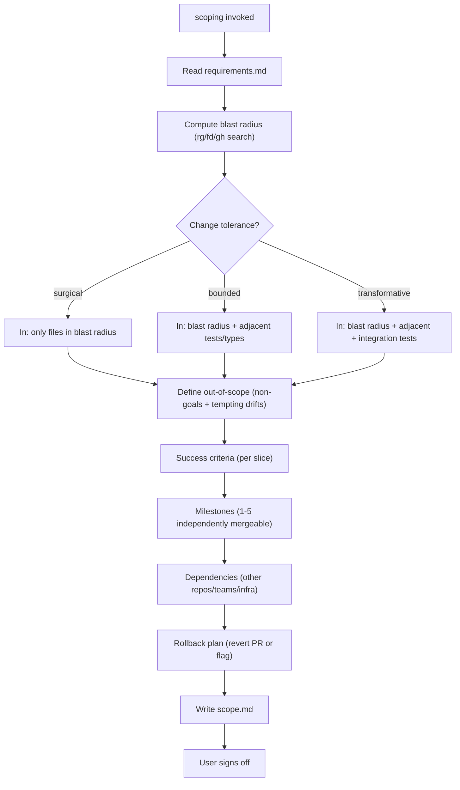
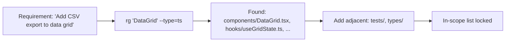

# `scoping` — how it works

```mermaid
flowchart TD
    Start["scoping invoked"] --> Read["Read requirements.md"]
    Read --> Blast["Compute blast radius (rg/fd/gh search)"]
    Blast --> Tol{"Change tolerance?"}
    Tol -- "surgical" --> SurgicalIn["In: only files in blast radius"]
    Tol -- "bounded" --> BoundedIn["In: blast radius + adjacent tests/types"]
    Tol -- "transformative" --> TransIn["In: blast radius + adjacent + integration tests"]
    SurgicalIn --> Out
    BoundedIn --> Out
    TransIn --> Out
    Out["Define out-of-scope (non-goals + tempting drifts)"] --> SC["Success criteria (per slice)"]
    SC --> Miles["Milestones (1-5 independently mergeable)"]
    Miles --> Deps["Dependencies (other repos/teams/infra)"]
    Deps --> Rollback["Rollback plan (revert PR or flag)"]
    Rollback --> Write["Write scope.md"]
    Write --> Approve["User signs off"]
```

## Blast-radius recipe

```mermaid
flowchart LR
    Req["Requirement: 'Add CSV export to data grid'"] --> Search["rg 'DataGrid' --type=ts"]
    Search --> Files["Found: components/DataGrid.tsx, hooks/useGridState.ts, ..."]
    Files --> Adjacent["Add adjacent: tests/, types/"]
    Adjacent --> InScope["In-scope list locked"]
```
