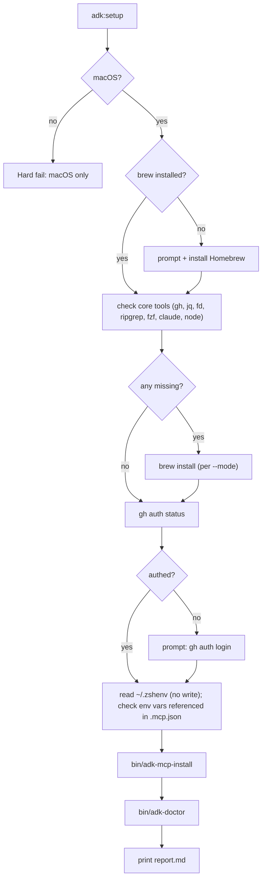

# `setup` — how it works

```mermaid
flowchart TD
    Start["adk:setup"] --> Detect{"macOS?"}
    Detect -- no --> Fail["Hard fail: macOS only"]
    Detect -- yes --> Brew{"brew installed?"}
    Brew -- no --> InstallBrew["prompt + install Homebrew"]
    Brew -- yes --> Tools
    InstallBrew --> Tools["check core tools (gh, jq, fd, ripgrep, fzf, claude, node)"]
    Tools --> Missing{"any missing?"}
    Missing -- yes --> InstallTools["brew install <missing> (per --mode)"]
    Missing -- no --> GhAuth
    InstallTools --> GhAuth["gh auth status"]
    GhAuth --> Authed{"authed?"}
    Authed -- no --> Login["prompt: gh auth login"]
    Authed -- yes --> Env
    Login --> Env["read ~/.zshenv (no write); check env vars referenced in .mcp.json"]
    Env --> McpInstall["bin/adk-mcp-install"]
    McpInstall --> Doctor["bin/adk-doctor"]
    Doctor --> Report["print report.md"]
```
