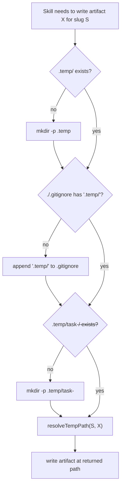
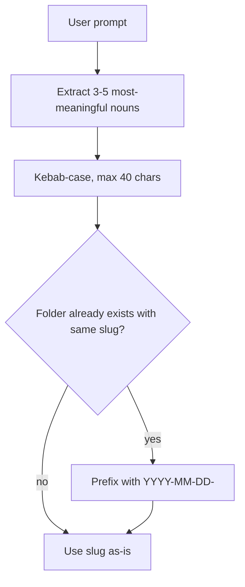

# `temp-folder` — how it works

## Path resolution flow

```mermaid
flowchart TD
    Start["Skill needs to write artifact X for slug S"] --> Q1{".temp/ exists?"}
    Q1 -- no --> CreateRoot["mkdir -p .temp"]
    CreateRoot --> Q2
    Q1 -- yes --> Q2{"./.gitignore has '.temp/'?"}
    Q2 -- no --> AppendIgnore["append '.temp/' to .gitignore"]
    AppendIgnore --> Q3
    Q2 -- yes --> Q3{".temp/task-<S>/ exists?"}
    Q3 -- no --> CreateTask["mkdir -p .temp/task-<S>"]
    CreateTask --> Resolve
    Q3 -- yes --> Resolve["resolveTempPath(S, X)"]
    Resolve --> Write["write artifact at returned path"]
```

## Slug derivation

```mermaid
flowchart TD
    Prompt["User prompt"] --> Extract["Extract 3-5 most-meaningful nouns"]
    Extract --> Kebab["Kebab-case, max 40 chars"]
    Kebab --> Conflict{"Folder already exists with same slug?"}
    Conflict -- yes --> Date["Prefix with YYYY-MM-DD-"]
    Conflict -- no --> Done["Use slug as-is"]
    Date --> Done
```

## Reading existing tasks

```mermaid
flowchart LR
    Q["Find prior work on topic T"] --> List["ls .temp/task-*/"]
    List --> Match["filter slug or report.md mentions T"]
    Match --> Pick["pick most recent"]
```
