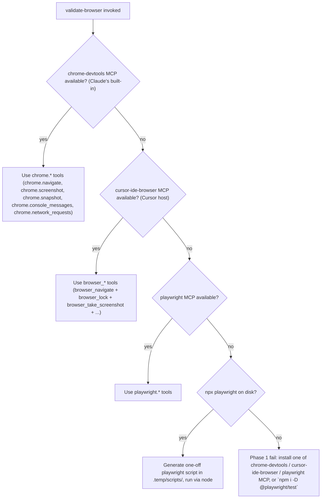
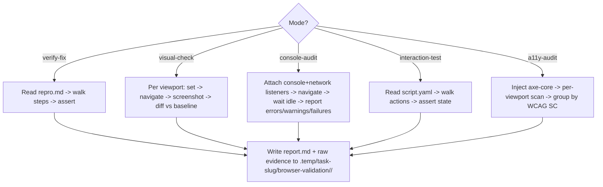
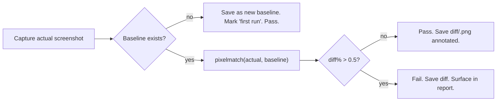
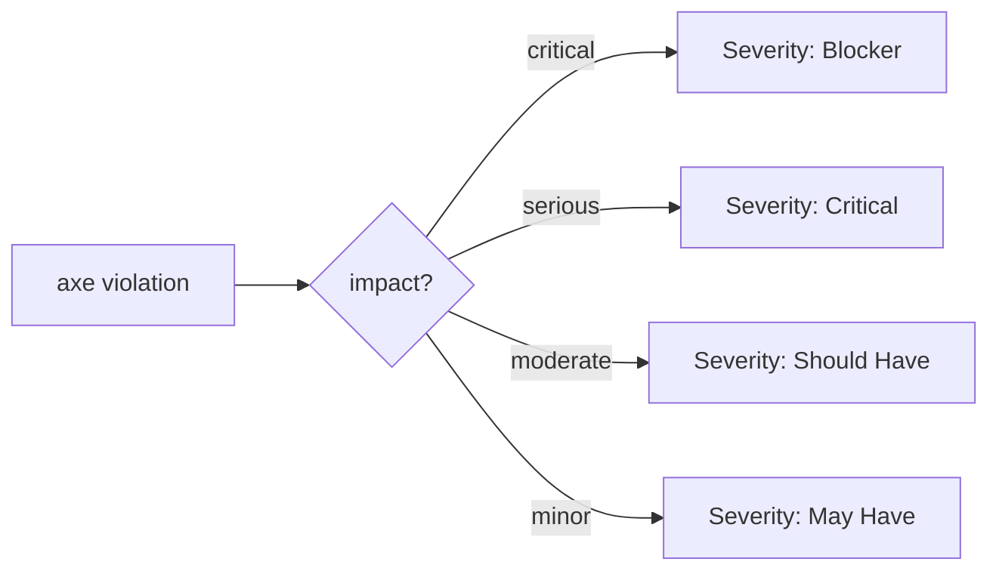

# `validate-browser` — how it works

## Backend selection chain (priority order)

The chosen backend is announced in the skill's status banner. Workflows below are written against an internal abstraction; an adapter maps to the picked backend's API (`chrome.*` vs `browser_*` vs `playwright.*`).

## Per-mode flow

## Visual diff threshold

## a11y-audit severity mapping

